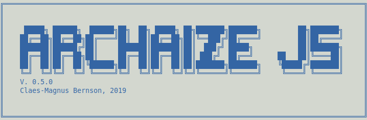

## Installation

```
npm install

npm test

```

## Usage

```
Usage: archaize [options]

Options:
  -V, --version            output the version number
  -a, --about              About Archaize JS
  -i, --input <filename>   Specify source code
  -o, --output <filename>  Specify output filename
  -m, --ast                AST analysis of file
  -t, --transpile          Transpile ES6 -> ES5
  -h, --help               output usage information

Examples: 

node archaize -i someCode.js -o code-analysis -m (will save AST as 'code-analysis.ast') 

-*-*-*-*-*

not supported yet:

node archaize -i someES6Code.js -o someES5Code.js -t 

-*-*-*-*-*
```

## Folder structure

- /assets (images)
- /examples (transpiled code snippets - before/after)
- /src **>>> /helpers, /utils, /transpiler <<<** 
- /tests (Jest - main functionality)
- /text (essay on transpilers)

## TASKS
 

**General (code)**
- [x] Add basic functionality to CLI
- [x] Create 'only AST' output option

**General (text)**
- [x] State question. About method & project scope
- [x] Introduction
- [x] The purpose of transpilers, or why transpiler matters
- [ ] How a compiler works in general terms (25% done)  
- [x] Abstract Syntax Tree
- [ ] Transformation 
- [ ] Summary
- [ ] General reflections. Difficulties, the future (...)


**Features (code)**
- [x] template literals 
- [x] variable declarations
- [x] arrow functions 
- [ ] string method: repeat
- [ ] string method: includes
- [ ] string method: startsWith
- [ ] string method: endsWith
- [ ] array method: find index
- [ ] array method: find
- [ ] operator: rest
- [ ] operator: spread

**Features (text)**
- [x] template literals 
- [x] variable declarations
- [ ] arrow functions 
- [ ] string method: repeat
- [ ] string method: includes
- [ ] string method: startsWith
- [ ] string method: endsWith
- [ ] array method: find index
- [ ] array method: find
- [ ] operator: rest
- [ ] operator: spread


**Finishing step**

- [ ] Research how to Use npm link, add bin to package.json and write a new README with usage, installation and small documentation.

