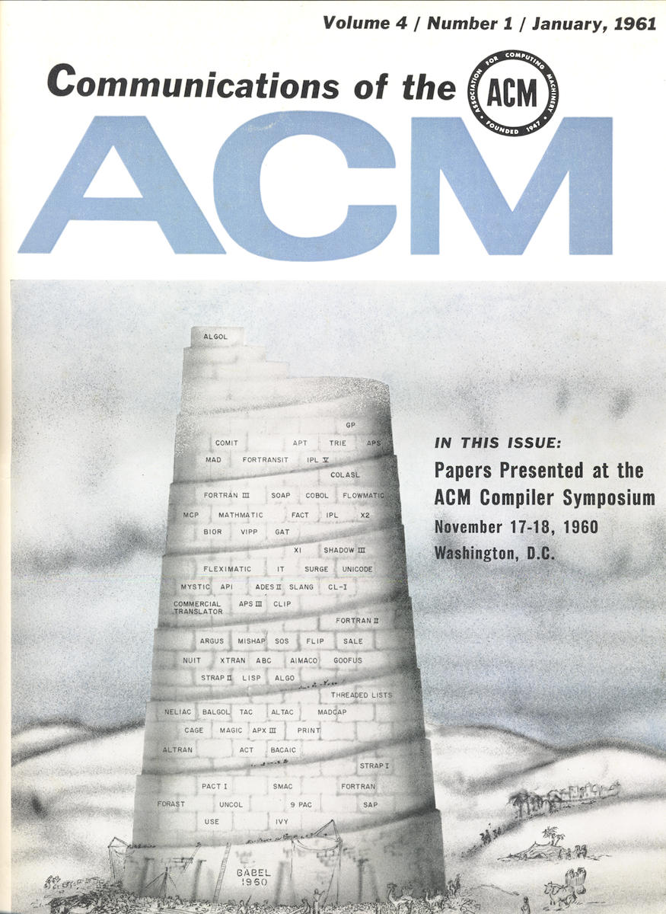

# APPENDIX

## Archaize JS dependencies

From package.json:

```
"dependencies": {
  "commander": "^2.19.0",
  "dandy-ui": "^1.5.0",
  "escodegen": "^1.11.0",
  "esprima": "^4.0.1",
  "estraverse": "^4.2.0"
}
```

- *Commander.js*. CLI-functionality (Node.js). 
- *Dandy UI*. Minimalistic terminal UI library (Node.js). 
- *Esprima*. Provides the Abstract Syntax Tree. 
- *Estraverse*. Library for traversing the JSON-like data. 
- *Estracode*. Transforms a Abstract Syntax Tree to source code. 

**The man dependency is Esprima.**


### On CLI's

CLI  is an  acronym for  Command-line Interface.  A CLI  can
include aspects of a GUI, a Graphical User Interface, but is
anyhow centered around text,  not graphical elements such as
buttons and 'window:ed' menus. In a GUI we navigate by using
the mouse or with some kind of keyboard shorthand.

In the case  of Archaize JS, I've chosen to  use a CL(U)I to
be  able to  focus on  the main  task, to  write parts  of a
transpiler. The  main advantage,  according to me,  with the
the  command-line is  that  it's built  to let  applications
inter-connect.  In the  Linux  environment,  this is  called
piping.

I  or someone  else would  include Archaize  JS (well,  that
would have to be a a future version that covers all features
and even then  it would not be recommended  at all; Babel.js
is by lightyears a better option)  in a project there is two
(actually three,  but I don't  count the child  processes of
Node.js here) main options:

* By  using the  Archaize JS  NPM package  and by  using the
functionality of `makeAST` and `transpile`.

* Or by including the CLI in package.json; something I would
recommend.

Archaize JS uses Commander.js to  handle the CLI part of the
application.  Commander.js provides  excellent functionality
for CLI's. Writing your own CLI is more complicated than one
might  think  and  would  involve quite  a  few  complicated
Regular Expressions  and lots  of `if-else`  expressions. My
guess  is that  you don't  wont to  bother about  that. When
writing a  CLI you  most of  the time want  to focus  on the
'logic',  the problem  your application  wants to  solve. My
contention  is that  there  are good  reasons  to honor  the
tradition of the Unix Philosophy  when writing these kind of
application. *Do one thing and do it well.* If you see to it
that the application is  'linkable', that other applications
can  'pipe' it,  you've created  a  small part  of a  larger
eco-system.


## Archaize JS Web solution dependencies

The Web solution uses Node.js,  Express and Socket.io on the
back-end. As view-layer on the  front-end, I use React. I've
used WebPack/Babel.js in the build process.

## Trivia

The notions  of transpiler  is old  as one  understands from
this cover:




