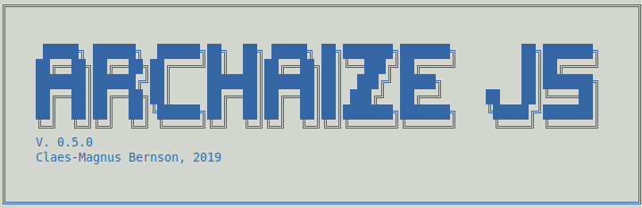

<pre>


</pre>


# Initialize text

<pre>
Using grip, it's possible to  view the text in your browser,
formated as any  other hypertext. I've used  this utility to
generate the  .pdf file. The .pdf  is merely a print  out of
this result.


```
less *.md > temp.md | grip temp.md && rm temp.md

```


</pre>


# Question
<pre>
This  essay tries  to answer  the question  on how  to build
a  transpiler,  using  modern JavaScript.  The  question  is
answered  using a  twofold course  of action:  a) by  use of
natural language (description,  analysis, reflection) and b)
by code (JavaScript).

My project  aims to  produce an ES6  to ES5  transpiler. The
transpiler will  have great similarities with  projects like
Babel.js. In fact, Babel.js has  been the point in the skies
I navigate towards, a North  star in the realm of JavaScript
transpilers. I  will concentrate  my energy on  the Abstract
Syntax Tree, to most interesting part, of a transpiler since
it's the 'hub' or 'nave' of the semantics - if you will, the
'logic' - in the process of transpiling source code.

In  the context  of Computer  Science, this  essay holds  no
value;  neither  does  the  code  part  of  the  project,  a
transpiler named Archaize  JS. Archaize JS is  to be thought
of as a demonstration, a proof of concept.

Is it  a scientific essay? Yes  and no. It is  scientific in
the sense  that it's  descriptive, analytical and  uses some
vocabulary  from Computer  Science. But  this essay  doesn't
intend to contribute to the  scientific body of knowledge on
transpilers. In a  way, it can though  still have scientific
value.  It  indirectly  helps  out  spreading  knowledge  on
transpilers.  And the  fact it  is less  advanced and  quite
flawed might  even be turned  to an advantage in  a didactic
context.
</pre>


### Method
<pre>
In a  sort, a compiler  is an advanced data  transformer and
the main  difficulty of writing a  compiler/transpiler is to
transform data according to specific rules.

With  great  distance, the  main  problem  and task  are  to
identify **differences**  in syntax between ES6  and ES5 and
resolve  them with  accurate translations.  I will  in short
strive to find patterns; a pattern is general in some sense,
and I hypothesize  that if I can find such  a pattern (for a
given feature) I'll be able to produce rules for translating
ES6  to ES5.  The  rules produced  is not  by  any means  in
themselves  to be  thought of  as 'necessary'.  Although the
expected output must be accurate. Another set of rules would
be able to produce the same output.

I've chosen an experimental  take on the problem. Confronted
with a problem, I've formulated some code covering a certain
problem. Then  I've compared the  syntax trees of  both code
snippets using  the BASH  applications diff and  sdiff. I've
also used Vims -d flag (`$vim -d file1.ast file2.asti`).
</pre>

#### Outline of Strategy

<pre>
* Write code covering a feature of ES6 not included in ES5
* Compare differences in the syntax tree
* Establish  rules that would be  necessary for transforming
differences in way  that would produce the  same end result,
identical output.
* Write code rules for transformation -> transform!
</pre>

##### Limitations

<pre>
A transpiler  consists of many  parts (more on  this later),
and  I have  limited  myself to  working  with the  Abstract
Syntax Tree using the Esprima library.
</pre>


## Project Scope (features)

<pre>
The  Website [es6-features.org](es6-features.org)  lists all
features of  ES6. Archaize.js won't  be able to  handle more
than a handful of the present features. My goal is to finish
the features stated below. These features, I think, could be
regarded as core features of  ES6, and therefore have higher
priority than lesser known and used features.

- template literals
- variable declarations
- arrow functions
- string method: repeat
- string method: includes
- string method: startsWith
- string method: endsWith
- array method: find index
- array method: find
- array method: includes
- operator: rest
- operator: spread (array)
- strict/type equality (===)
- default parameter
</pre>

## Finished Product
<pre>
* ...a ES6 to ES5 transpiler (main part)
    * Feature list include the core of ES6
    *  Theory.  How a  transpiler  works  and why  they  are
important
* ...a NPM package
* ...a CLI to transpile JavaScript files
* ...a Minimalistic Web Solution 
    * Front-end (React)
    * Back-end (Node.js, Express & Socket.io)
</pre>


## In a nutshell

<pre>
In short,  the purpose  of this essay  is not  of scientific
nature;  it's more  a proof  of concept  (and even  then you
would  have to  be  quite liberal).  It's  also possible  to
regard  what  I  do  a  case  study,  the  equivalent  of  a
scientific experiment in a laboratory, performed in subjects
such as chemistry in high-school.

My  view  on  the  purpose is  double:  firstly,  I  acquire
knowledge of how compilers  are built; secondly, I'm sharing
this knowledge.

As far as my knowledge goes, there are few, if any, in-depth
texts Online written  in the context of JavaScript  on how a
transpiler is  configured, combining concrete  code examples
with 'theory'.  There are  quite a few  texts on  Babel, but
none of  them really  deals with examples  and only  in very
general terms explain the meaning of compilers.


</pre>
# Introduction
<pre>
This  essay  is my  way  to  substantiate  how my  (or  any)
transpiler works.  To manage this task,  it seems reasonable
to first explain what a compiler is.

Often a compiler is viewed as a magic box. You put something
into it and then gets an  executable file. But a compiler is
merely a  translator. It takes  an input (some  source code)
and  outputs a  translation  of  this code  in  the form  of
another code; for instance an executable file, or at least a
code that's closer  to the ones and zeros of  the metal. The
compiler is able to make this happens by a translation based
on rules, a grammar.

We can now  give some kind of answer to  the question stated
above. A  compiler translates  one code  to code  in another
language (it may be executable, butit can also be some other
kind of code).  A transpiler, on the  other hand, translates
(or rather  transforms) code  from one language  to another,
with the implicit distinction that  on some level the 'code'
stops being a  language fit for communication  (fit for use)
and  therefore viewed  more as  part of  the machine,  being
'metal'. A transpiler can also,  something which is true for
the transpiler of the project, translate 'within' the *same*
language.

Let's for the time being  equate compiler and transpiler and
continue  with  an  exposition  on what  a  compiler  is  by
comparing  programming languages  with natural  languages.In
contrary to grammars of natural  languages, the grammar of a
compileris exactly as precise as  it is 'intended'. In fact,
otherwise,  it wouldbreak  the  chain  of translation:  each
level of 'abstraction' must, inthe end, be possible to level
down to a precise,  unambiguous 'system'level (10010100 ...)
or anyway a code closer to this state (which is the casewith
languages that get 'interpreted', for instance, JavaScript).

The  direction of  the motion  is in  this sense  often (but
necessarily)  the  same.  A   compiler  often  translates  a
high-level language to less  abstract expressions of thesame
'meaning', 'intend'.  Something which provides  an intuitive
explanationof the  lengthiness of the  Assembler programming
language code, a language closer to the system core than for
instance C, a language which is, relatively speaking, closer
to the core than for instance JavaScript.

A 'sentence' in code is  Grammarly  speaking either, given a
context, unambiguously correct  or it's incorrect; something
that  may or  not  be true  concerning  grammars of  natural
languages. This is not the  case with compilers; the grammar
of  a compiler  must provide  a  set of  definite rules.  An
expression can only have *one* meaning in the context of the
grammar, but  with that said it  might not be the  case that
the application  actually does precisely what  the developer
intended it to do.

However,  the  application does  exactly  do  what the  code
intends  it  to do.  Therefore  i.e.  the  notion of  a  bug
provided that the application at all executes, is a conflict
between what  the application is  told to do by  the codeand
what  the developer  wants  it to  do (apparently  something
else).

A transpiler, on  the other hand, have a  grammar with rules
concerning how to  change the code. Up to the  point of code
generation, a  compiler and  a transpiler include  the exact
same procedure. It's only  the output that slightly differs;
this difference seems to fade if you look close enough. As I
see it,  you can use  these two notions as  synonyms without
feeling bad.

The transpiler often contracts  or expand the formulation of
the 'meaning' of the code, thus making it longer or shorter.
In  the realm  of  JavaScript, Babel  JS  is themost  famous
transpiler and  also the 'norm' -  the canon - which  I will
try to mimic.

Babel  JS translates  (transpires)  JavaScript written  with
features from more modern (ECMAScript) specifications of the
language to  code compatible with older  specifications. The
purpose  is to  serve the  user,  regardless of  his or  her
browser version. I believe this motivation is an ethical and
a praiseworthy  ideal in  the spirit  of the  Web as  it was
envisioned by Tim Berners-Lee, its inventor.

To me, it's strange how one could *not* be interested in how
a compiler works if you're  an application developer. On the
other  hand, I  always  want  to gothe  roots  of a  subject
matter that  interest me and totally  ignore some thingsthat
(perhaps) *should* interest me.

It's my belief,  still to be proved to  myself, that insight
into how a compiler works  will deepen your understanding of
how to use programming languages in general.


/ Claes-Magnus Bernson


</pre>
# Purpose, or why transpilers matter

<pre>
Even  though a  scientific  essay should  be objective,  the
motivation for writing  an essay is **not**,  neither is the
importance of the subject itself. Much of the last centuries
debate in  the philosophy  and the social  sciences revolved
around  questions on  the value  of a  certain pursuit.  The
general  consensus,  I  think,  was that  there  are  better
reasons to the  relativize these matters and  relate them to
social norms  than to ignore these  matters. Your scientific
pursuit might be pure(although it's  likely not, or at least
partly not), but the consequences  of the same pursuit might
lead to things you did not wish for. Sometimes the pale cast
of thought  - to contradict  the Hamlet of Shakespeare  - is
quite good.

In  the  year  2019,  transpilers are  more  important  than
ever.  And  why?  Because  we  need  and  want  the  Web  to
be  inclusive,  and  in  the   context  ofthe  Web  and  Web
development this is spelled backward compatibility. This has
also  been the  spirit  of the  Web  since its  origination.
As  Tim   Berners-Lee,the  inventor  of  the   Web,  [stated
it](https://www.w3.org/People/Berners-Lee/1996/ppf.html)1996 
"information  must be  available on all platforms, including 
future ones".

If you want to use modern JavaScript, it's important to make
use of  a transpiler,  otherwise you'll most  likely exclude
users  with  old  Web-browsers.  To me,  there's  a  ethical
dimension to this, but for companies and organizations there
also might  be economical motifs  for backward-compatibility
(otherwise you face the risk of losing potential customers).

A    quick     glance    at    [The     ES6    Compatability
Table](https://kangax.github.io/compat-table/es6/)   clearly
demonstrates  the need  for  backward-compatibility and  the
only way of  using some functions, is to  use 'polyfills'. A
polyfill  is a  snippet  of code  with  the same  'semantic'
meaning  as  another  code  snippet, but  with  a  divergent
'formulation' that  works in  older browsers. Its  intent is
the same, but the syntax differs.

Before   the  arrival   of   good  JavaScript   transpilers,
developers  had   to  make   fall-backs  so  that   the  Web
application  would work  on old  browsers, or  with browsers
lacking some aspect of  the JavaScript language. A classical
example  would  be  the   poly-fills  developers  wrote  for
Internet Explorer.

After      the      advent     of      transpilers      like
[Babel.js](https://babeljs.io/),  poly-fills  is  (probably)
not used as often. Instead,  you include Babel.js in a build
environment like Webpack (or  use it manually), to transpile
code. The benefits  of this are that the  developer can take
full  advantage of  the  latest  language features,  without
having to bother about browser compatibility.

Because  of  all   of  this,  it's  important   as  well  as
interesting  (at  least  if  you have  a  curious  mind)  to
understand how a transpiler  actually works. In programming,
the best way to gain a deeper understanding is often said to
Do It Yourself.

To me, this  means that you must acquire  both a theoretical
understanding  of the  subject  matter as  well,  as do  the
required programming.  Otherwise, you'll fumble in  the dark
and can't communicate what you do; I would even say that you
don't know what you're doing - theory matters.

My transpiler, named  Archaize JS, will neither  be the best
or even good nor  support full functionality for transpiling
ES6 to ES5. But it will be a functional transpiler.


</pre>
# Overview. How compilers work
<pre>
A  compiler  consists of  two  parts:  analysis (front  end)
and  synthesis (back  end).  Analysis of  the code  precedes
synthesis  in the  compiling process.  Before compiling  the
source code  is broken  into parts, enforcing  a grammatical
structure.   This   form   an  intermediate   structure   of
'abstractions' (a abstract  syntax tree), representations of
the source at hand.

If   the   compiler   finds   that  the   source   code   is
problematic/erroneous,  it will  halt  and  log the  warning
and/or errors. If the source,  on the other hand, is correct
(there  by not  guarteing it  actually works;  it can  still
include  major bugs),  it  produces a  symbol table  storing
data  present in  the code.  The synthesis  builds upon  the
representations  and the  symbol table  from the  front end,
producing a translation into a new code — the target code.

I  will explain  in  more  detail the  inner  workings of  a
compiler/transpiler more  properly later  on, but  the table
below should  provide a  basic understanding of  the subject
matter. I've  made the table  by melding figure 1.5  (p. 4),
1.6  (p.  5)  and  1.7  (p.  7)  in  Compilers,  Principles,
Techniques,  and Tools  (the  second edition,  2014) -  also
known as The Dragon book -  by Alfred V. Aho, Monica S. Lam,
Ravi Sethi & Jeffrey D. Ullman.

For  now, don't  bother much  about the  terminology to  the
left. Concentrate  on code  and how  it gets  transformed. I
believe the example to be quite self-explanatory.
</pre>

```
+----------------------------------+-----------------------------------+
|           ABSTRACTION            |              EXAMPLE              |
+----------------------------------+-----------------------------------+
|  character stream                |  let area = a**2                  |
|                 ↓                |                                   |
|  Lexical Analyzer                |                                   |
|                 ↓                |                                   |
|  token stream                    |  <let> <id,1> <=> <id,2> <**> <2> |
|                 ↓                |                                   |
|  Syntax Analyzer                 |         let                       |
|                 ↓                |          |                        |
|  syntax tree                     |          =                        |
|                 ↓                |        /   \                      |
|                                  |   <id,1>    **                    |
|                                  |         /    \                    |
|                                  |     <id,2>    2                   |
|                                  |                                   |
|  Semantic Analyzer               |                                   |
|                 ↓                |         let                       |
|                                  |          |                        |
|  syntax tree                     |          =                        |
|                 ↓                |      /       \                    |
|                                  |  <id,1>   <id,2> * int            |
|                                  |                     |             |
|                                  |                     2             |
|                                  |                                   |
|                 ↓                |                                   |
|  Intermediate Code Generator     |                                   |
|                 ↓                |                                   |
|  intermediate representation     |  id1 = id2 * int(2)               |
|                                  |                                   | 
|                 ↓                |                                   |
|  Machine-Interdependent          |                                   |
|  Code Optimizer                  |                                   | 
|                 ↓                |                                   |
|  intermediate representation     |  id1 = id2 * id2                  |
|                 ↓                |                                   |
|                                  |                                   |
|  Code Generator                  |                                   |
|                 ↓                |                                   |
|  target-machine code             |  Weird code, your name is...      |
|                 ↓                |  ...ASSEMBLER... (or something    |
|  Machine-Dependent               |  else)                            | 
|  Code Optimizer                  |                                   | 
|                 ↓                |                                   |
|  target-machine code             |  ... 010010000101011 ...          |
+---------------------------------+------------------------------------+
```

<pre>
So, a compiler consists of  front-end and a back-end (not to
be confused with how the words are used in web development).
Basically, the front-end handles the 'input' (source code of
some sort) and the back-end the 'output'.

You provide  the front-end with  code, the code  is analyzed
and  re-structured  according  to the  rules  (the  grammar)
of  the compiler/transpiler.  If  the  code doesn't  include
problematic  parts  (errors;  i.e.   some  variable  uses  a
reserved keyword) the compiler proceeds to the next phase or
step, the back-end.

The product of the back-end  transforms the code. It doesn't
change  its  'meaning'  or 'intend',  but  re-structure  the
code  to  another  'modality'.   That  modality  may  be  an
executable file, a  file the user can run. It  may also be a
transformation of the  code from a high-level  language to a
low-level  language, an  Assembler language.  In that  case,
you'd need an Assembler to  actually interpret and 'run' the
code, execute it. You  may or may or not also  make use of a
Linker;  a  Linker  hides  this  relationship  so  the  user
can  execute the  code  without having  to  bother about  an
interpreter.

A transpiler  always halts  before or  at the  Assembly part
(for  instance WebAssembly  halts  here).  But a  transpiler
might also translate between  different levels, which is the
case of my transpiler or of Babel.js.

The most important  thing for a compiler or  a transpiler is
to keep the intent, make sure that the semantics of the code
is preserved. Otherwise, the  developer would be clueless on
how the code would actually 'turn out'.

Let's say something  about the steps described  in the table
above.

* The lexical  analysis (also called a  scanner) handles the
input as a stream of characters. It takes the code apart and
then performs an analysis  on how it's structured. Different
languages make  use of  different delimiters.  Sometimes the
'use' of delimiters are referred to as 'tokenization'.

* After the lexical analysis,  the syntax analyzer checks if
every categorized item is valid  according to the rules (the
grammar) of the language. If the  code would use of the word
'private' (a keyword in many  languages) and the language of
the compiler  doesn't use  the 'private' keyword  this would
not be a valid expression. Each 'block' must be accurate, or
the construct would be faulty. This,  however - as I said in
the introduction - doesn't mean  that the code can run, that
the code  doesn't include bugs and  so on. I only  mean that
the code is accurate, it doesn't mean the semantics actually
produce  something  (to  us) 'meaningful'.  This,  i.e.,  is
**valid** code in JavaScript of ES6:

```
{}
```
This IIFE  doesn't **do** anything.  It will be  called when
interpreted, but  nothing 'happens'. These  distinctions are
important to  bear in mind  when relating to  programming in
general and compilers/transpiler in particular.

*  If the  code  is  valid according  to  the  rules of  the
language, the compiler/transpiler produce an Abstract Syntax
Tree (AST).  This part will  be covered in the  next chapter
in  some more  detail.  Shortly, the  AST holds  un-detailed
information on the application. The main function of the AST
is the 'bigger picture', how  different parts relate to each
other in  a tree-like  hierarchy. Just  like any  other tree
data structure,  it contains  nodes; each  node is  either a
parent and/or a  child. The end nodes are  often referred to
as 'leaves' in this context. All  this is done by a 'context
analysis'.  It's  enough  that  each  program  statement  is
accurate in itself, it must also  be valid in how it relates
to other parts of the architecture.

* Intermediate  Code Generator/Code Optimizer. I  guess this
part is not  mostly included in a transpiler.  In a compiler
this  phase adopts  the source  code to  the machine,  so to
speak. What's readable to us is not that important here; the
focus  is to  make changes  that would  help the  machine to
execude the code more efficient.  In the context of a normal
computer, this  means that the optimization  focus on memory
and performance  (speed). If  the programming  language i.e.
would include some kind of unneccessary abstraction it would
be replaced with more 'concrete' code.

* Code  generation. In a  computer, everything is  'code' in
some sense.  But there is  a 'semantic gap' between  what we
would  normally consider  readable and  the code  **of** the
machine. At  the childhood  of computers,  enthusiasts would
hardcode  these codes  to the  computer on  a pure  'system'
level. But  the lengthiness  of a programming  language like
Assembler pales  in comparison with  that kind of  codes. It
would  be still,  I guess,  be  code since  it would  follow
'rules', namely the  rules inherent in the  processor. I bet
there would  be quite a  few ones  and zeros to  express the
number five.


</pre>
# The Abstract Syntax Tree
<pre>
In this  project, the real  work begins *after* -  or rather
*with* the Abstract Syntax Tree, AST, since Archaize JS make
use   of   [Esprima](https://www.npmjs.com/package/esprima).
Let's begin by explaining what comes before an AST.

Any  compiler  or  transpiler  starts out  with  streams  of
characters. The streams of characters constitute the program
code.

Consider this JavaScript code:
</pre>

```
function addNums(...nums) {
  return nums.reduce((a, b) => a + b);
}
console.log(`2 + 2 = ${addNums(2, 2)}`); 
// output: 2 + 2 = 4
```

<pre>
Esprima includes both a lexical analyzer (a tokenizer) and a
syntax  analyzer (another  word for  AST). Somewhere  in its
inner workings, it  starts out with by  performing a lexical
analysis of  the code  (["function", "addNums",  "(", "...",
"nums", ")" ...]).

A  lexical analysis  breaks down  the code  into atoms,  the
smallest possible semantic  unit of the code,  and creates a
symbol table  for all sorts  of declared names (in  the case
above: nums, a and b).

The  'atoms' would  also include  'keywords' like  function,
return,  reduce etc.  At the  end of  this process,  a token
stream emerges, replacing the  character stream. I guess you
could see it  as a sort of word-list of  'words', present in
the program code.

The next step is called syntax analysis and creates the AST. 

For  purposes of  understanding,  I think  it's valuable  to
contemplate  the difference  between something  abstract and
concrete. Something abstract or abstractions in general, are
only  possible  as derivations  of  a  concrete 'entity'  of
some sort;  it provides  a 'distance'  and brings  about the
essentials of  the concrete  subject matter,  while ignoring
what's trivial (depending on the context).

When  the code  is  considered in  the  syntax analysis,  it
focuses  on  the  semantics  of  the  programming  language,
ignoring, for  instance, the visual  elements of a  code. In
most  programming  languages  (Python  being  an  exception)
indentations (tabs) are for 'us', not the machine - it's not
an essential part of the code to the machine.

The same thing  is true also for the 'concrete'  syntax of a
language. Most  programming languages use functions,  but in
the inner  workings of  an AST  *how a  programming language
actually  programmatically requires  the  user  to spell  is
trivial*  (func  or  function). Therefore  what  things  are
"called"  -  that  is,  the  naming  of  the  "abstractions"
-  are   contingent.  One   would  hope  though,   that  the
transpiler would  make use  of a explanatory  naming system,
something that's  the case with Esprima  (and Acorn, another
quite  famous  AST-ifier)  who  follows  the  suggestion  of
the  project [ESTree](https://github.com/estree/estree/),  a
standardization project.

These  kind  of abstractions  are  useful  to the  compiler,
enabling a  way to translate  from one language  to another.
Esprima,  following ESTree,  would  articulate a  AST for  a
function with this kind of terminology:
</pre>

```
{
      "type": "FunctionDeclaration",
      "start": 0,
      "end": 68,
      "id": {
        "type": "Identifier",
        "start": 9,
        "end": 16,
        "name": "addNums"
}
```

<pre>
As you can  see, an AST much resembles any  JSON object with
data. Everything has  a key and value; and a  value can also
be another key holding other values.


</pre>


# Archaize JS Features
<pre>
The following chapter will contain a number of sections with
an identical structure. Each  section will first provide the
background of a  feature. It will describe  what the feature
does, how  it works and  give some code examples.  With this
background  at  hand,  the  problem  in  the  context  of  a
transpiler -  more specifically, in the  context of Archaize
JS -  will have some room.  In most cases, I  won't describe
any  solutions or  reflect  on the  problems  attached on  a
deeper level.

Sections will  topic each  feature, excluding  the polyfills
that will be gathered, clumped together under one umbrella.


- template literals
- variable declarations
- arrow functions
- string method: repeat
- string method: includes
- string method: startsWith
- string method: endsWith
- array method: findIndex
- array method: find
- array method: includes
- operator: rest
- operator: spread (array)
- strict/type equality (===)
- default parameter
- property shorthand


</pre>
# Arrow Functions


## Background. What's an arrow function?
<pre>
The advantage of fat arrows,  arrow functions because of the
`=>`, resides in a) it's not as lengthy as a normal function
and b) it's binding of (lexical) this.

An  arrow function  can be  expressed in  quite a  few ways.
Beneath you'll  find some examples  on how you can  write an
arrow  function. These  examples constitute  a selection  of
different use  cases of  arrow functions and  differences in
how you can write them.
</pre>


#### Type A (an example). The shorthand part.

```
const totalSum = (...nums) => nums.reduce((a, b) => a + b);

const sayHiTo = (name) => `Hi ${name}!`;

const sayHelloTo = name => `Hello ${name}!`;

const injectThisDate = (string, pos) => {
  if(typeof pos !== 'number' || typeof string !== 'string') {
    return -1;
  } else if(pos > 0 && pos < (string.length - 1)) {
   let firstPartOfString = string.slice(0, pos);
   let lastPartOfString = string.slice(pos, string.length);
   return `${firstPartOfString}${Date()}${lastPartOfString}`; 
  } else {
    return undefined;
  }
}; 
const somethingToSayAtBreakfast = `Todays date () might be last 
day before Earth spinns out of orbit and enter an voyage throughout space.`;
console.log(injectThisDate(, 13));
/*"Todays date (Sat Jan 26 2019 08:20:42 GMT+0100 (Central European Standard 
Time)) might be last day before Earth spinns out of orbit and enter
 an voyage throughout space." :)*/

const authors = [{name:'Virginia Woolf', maritalStatus: 'Mrs.'},
 {name:'Alice Munroe', maritalStatus:'Ms.'}];
const formalAuthorNames = authors.map((author) => `${author.maritalStatus} ${author.name}`);
```


#### Type B (an example). The `this` part.

```
// Example from http://exploringjs.com/es6/ch_arrow-functions.html

function UiComponent() {
  const button = document.getElementById('myButton');
  button.addEventListener('click', () => {
    console.log('CLICK');
    this.handleClick(); // lexical `this`
  });
}

// But with an example on how it would've been written before:
function UiComponent2() {
  const button = document.getElementById('myButton');
  var self = this;
  button.addEventListener('click', function() {
    console.log('CLICK');
    self.handleClick(); // lexical `this`
  });
}

```


### Problem
<pre>
The main difficulty handling  arrow functions in the context
of a transpiler,  is that the arrow function can  be used in
more  than  one context.  This  differentiates  it from  for
instance  a  variable  declaration. An  arrow  function  can
be  anonymous, a  parameter  of another  function and  will,
therefore,  can  have  lots  of  diffent  locations  in  the
hierarchy of the AST.

In  actual  code,  this  makes  no  difference.  A  'normal'
function also  have a name  (if it's not anonymous  and only
gets called  in a certain context,  as a part of  a specific
functionality) and transforms a value or many values. But it
will  nevertheless  be sorted  as  a  part of  the  variable
declaration, rather than the function declaration. The arrow
function  declaration  gets  its  name  in  the  context  of
variable declaration.

Also,  we must  handle the  `this`  part. We  must inject  a
variable (and  it'll follow  tradition and be  named 'self')
into the  AST. If  we look at  how a `this`  is used  we can
conclude that  if we regard  the functionality in  which the
`this`  is used  a  child node,  the  variable named  'self'
should  belong to  the parent.  Therefore we  must append  a
variable declaration to the parent node. Because it's easier
and  more  efficient to  traverse  the  'tree' from  top  to
bottom, we will look for  any parent containing a child with
an arrow function making use of `this`. If this is the case,
we'll  inject  a  variable  declaration  named  'self'  that
contains the (lexical) `this` so that 'self' would have this
context stored before the program enters the child node.


</pre>
# Default parameters

<pre>
The   possibility   of   default  parameters   in   function
definitions is also one of ES6 'shorthands'.
</pre>
´´´
function someFunc(a = 'a', b = 'b') {
  console.log(a, b) 
}
someFunc(); // a, b
´´´
<pre>
Its use is  that you don't have to bother  about setting the
variable if  it's 'void'.  A 'void' parameter  in JavaScript
gets  assigned to  `undefined`. Pre-ES6,  you would  set the
parameter  to a  default value  in the  body of  the defined
function.
</pre>


### Problems
<pre>
I  can't see  any major  problem attached  to this  feature.
What's important is  to inject the default value  at the top
of the function body,  otherwise, problems (of course) could
arise when using it.


</pre>


# ES5 polyfills


## Background
<pre>
Archaize JS includes ES6 subroutine features. In the case of
a subroutine,  the problem is  not to transform  an existing
Abstract Syntax  Tree, adapt  it to match  a changed  set of
criteria. Every time ES6 code makes use of a new subroutine,
in this case, some method, we must inject this functionality
to the ES5 code.

We must  add a function,  a 'polyfill' that solves  the same
problem and  in the  same way.  This polyfill  function must
also accept the same parameters and so on.

JavaScript is not *a* thing, it's several things. We tend to
speak  of  it  as  it  is one  thing  only  for  reasons  of
convenience.  JavaScript is  interpreted  in real-time,  you
can't compile it an end up with some sort of executable file
(unless you make use of  some kind of 'external' framework).
This true for the browser, as well as for Node.js. Sometimes
it's  unclear what  actually  belongs to  the language,  and
what's an 'alien' implementation.

Can we  i.e. say that `addEventListener`,  a browser method,
is a part  of JavaScript, `CreateEvent` in  Node.js are part
of the  language although these functionalities  don't exist
on  the  'other' side?  Or  what  about different  'machine'
libraries  (Nodebot.js) or  Virtual Reality-libraries?  They
may  have  basic subroutines  that  are  dependent on  their
'modality', the specific context at hand.

JavaScript  is  a  living  language,  just  like  a  natural
language in a sense. If I  would write my own engine and add
a  feature  to  the  language,  it would  also  be  part  of
JavaScript. This is actually often the case, thus the tables
on compatibility  at MDN. No one  can 'own' it to  the full.
But with  this said, just  as with a natural  language there
are standardizations. THE  ECMAScript Specification provides
a mean to establish the lowest common denominators, although
this is not either totally true. Often it takes years before
all engines  have implemented the new  features described in
the specification. And as I  said, the specification is only
concerned with lowest common denominators.

If  a  new  Node.js  release would  include  an  environment
specific  functionality,  it  got  nothing to  do  with  the
ECMAScript  Specification.  Node.js  also  doesn't  have  to
implement  all  the  features   of  the  Specification,  the
Specification  is not  'binding'  in any  formal sense.  The
specification is more  of a series of suggestions  on how to
standardize JavaScript features.  It suggests *conventions*,
just like for instance grammars of natural language.
</pre>


## Code
<pre>
Each polyfill included in this  transpiler include a link to
the relevant section of  the ECMAScript specification at the
top of the sourecode.


</pre>


# On property shorthands
<pre>
The property  shorthand of  ES6 admits declaring  keys whose
value is a reference to a variable with the same name as the
key.
</pre>

```
let a = 1;
let b = 2;
let obj = { a, b };
console.log(obj); // { a: 1, b: 2 }
```


### Problems
<pre>
Solving  the  AST  transformation  of this  feature  can  be
handled  by  'explicitivity'.  Instead  of  relying  on  the
JavaScript engine to handle this inference, you just provide
the reference. Thus doing it compatible with ES5: `let obj =
{a: a, b: b}`.


</pre>


 
# Background


## Rest
<pre>
In JavaScript ES6, the `rest`  operator makes it possible to
collect an arbitrarily large number of parameters, stated in
the function definition. It would look like this:
</pre>

```
function addNums(...nums) {
  return nums.reduce((a, b) => a + b);
}
console.log(addNums(1,1,1,1,1)) // 5
```
<pre>
This  feature surelymakes  your  life easier,  but the  main
functionality is not unique. In ES5 you could have written a
function with the same semantic meaning:
</pre>

```
function addNums() {
  var nums = Object.values(arguments);
  return nums.reduce(function(a, b) { return a + b; });
}
console.log(addNums(1,1,1,1,1)) // 5
```
<pre>
(Object.values is ES5 and arguments is a object containing a
key for each parameter expressed in a function call.)

This would also be a case that therefore can be solved using
polyfills, although  the polyfill,  in this case,  is rather
small.
</pre>


## Array spread
<pre>
You can do something very  similar when handling arrays. The
same is true for objects but  that would be out of the scope
of this project since it's a feature of ECMAScript 2017.

The array spread  operator makes it possible to  use a handy
shorthand (and doesn't have to use the concat method):
</pre>

```
const humanCharacters = ['Luke Skywalker', 'Princess Leia', 'Darth Vader'];

const robotCharacters = ['C3PO', 'RJD2'];

const humansAndRobots = [...humanCharacters, ...robotCharacters];
```


### Problem
<pre>
When replacing the rest  operator in the function definition
you have  to make use  of the arguments object,  you'll also
need to inject the values  method inherit in Object (or some
other  solution) at  the first  line  to make  sure that  no
function make use  of any of the parameters  included in the
function definition.

A problem that might arise  would be if other parameters are
included in the function definition.
</pre>

```
function someFunc(param1, param2, ...allOtherParams) {}
```
<pre>
In that case  you need to exclude those  from arguments when
using  the object  arguments  array,  otherwise, they'll  be
duplicated.  The arguments  object contains  all parameters,
including (in the example above) param1 and param2.


</pre>
# On Strict (in)equality


## Background
<pre>
Strict equality is impossible in ES5. You **can** do it on a
global  level  with a  polyfill,  with  a customized  Object
method (defineProperty).  But in a  local scope it  can't be
done.

In ES6 this code would print 'TRUE':
</pre>
```
let number = 5;
let numberStr = '5';

number === numberStr?
  console.log('TRUE') 
  : 
  console.log('FALSE');
```
<pre>
But  if you  would replace  `===` with  `==` it  would print
'FALSE'.  Because JavaScript  is  a  dynamically typed  it's
possible, if  the variable declaration did  not use `const`,
to re-define the data type:
</pre>
```
numberStr = 5;
console.log(typeof numberStr)
```


### Problem
<pre>
The  main  difficulty here  is  that  the application  using
strict equality  only can use in  a development environment.
Or  rather, it  can  only  truly benefit  from  it. If  type
checking is  relevant later on,  it must be done  in another
fashion.  I guess  this  doesn't  have to  be  a problem  at
all  (especially not  since the  transpilation takes  places
afterward), but I also presume it can be a problem depending
on how the code base is transfigured.

I, therefore, see  no way to guarantee  that a transpilation
would  fully  respect  this   feature.  Even  though  strict
equality  is possible  (with polyfills)  on a  global level,
it's  not -  as  I  said earlier  -  possible  in the  local
scope. I  presume it would  possible to solve this,  but the
strategy  would  have to  more  complicated  than you  might
think  at first.  My 'solution'  is no  real solution,  I've
merely replaced each occurrence  of strict equality with its
unstrict counterpart.


</pre>
# On template literals


## Background
<pre>
An  Expression represents  the  production of  some sort  of
'value'.  It can  hold  an 'immediate'  value  (a string,  a
number or some other data type like a boolean), or represent
a value  by a  reference to  a variable,  a function  or for
instance a mathematical formula.

A  template literal  in ES6  admits embedded  expressions in
strings.  You  can  embed variables,  functions  or  general
expressions  (for  instance  mathematics)  -  all  kinds  of
expressions.

Let's begin by exemplifiing how template literals are used:
</pre>
```
const firstName = "Luke";
const surName = "Skywalker";
const name = `${firstName} ${surName}`;
```
<pre>
This contrasts with the old,  pre-ES6 way of doing things. A
transpiler  whose task  is to  'archaize' modern  JavaScript
must handle this change. With and before ES5, you would have
to use  a binary  expression (a 'join')  to manage  the same
kind of problem:
</pre>
```
var firstName = "Luke";
var surName = "Skywalker";
var name = firstName + " " + surName;
```


### Problem 
<pre>
This  means,  that  between *each*  expression  a  'joining'
procedure would have to be in place. With the terminology of
ESTree, you'd  call this a 'Binary  Expression'.It could, of
course,  be some  other kind  of binary  expression, if  you
handle non-strings(3 - 2 and so on).

The syntax  tree for  template literals  is a  bit different
from that of ordinary literals, that (if more than one) must
be 'joined' by some kind  of binary expression, usually with
an additive logic.

The problem at hand, therefore, is that if you want to write
a polyfill  for template literals you  must gather necessary
'facts' from the part of the AST that uses template literals
and convert those into literals, joining the (using a binary
expression) included literals in a way compatible with ES5.

Now consider this (ES5) code snippet.
</pre>
```
var name = "C-M";
var str = "As of this date (" + Date() + "), I, " + name + ", (...)";
```
<pre>
ESTree would produce an AST with the following structure:
</pre>
```
{
  "type": "Program",
  "body": [
    {
      "type": "VariableDeclaration",
      "declarations": [
        {
          "type": "VariableDeclarator",
          "id": {
            "type": "Identifier",
            "name": "name",
            "range": [
              4,
              8
            ],
            "loc": {
              "start": {
                "line": 1,
                "column": 4
              },
              "end": {
                "line": 1,
                "column": 8
              }
            }
          },
          "init": {
            "type": "Literal",
            "value": "C-M",
            "raw": "\"C-M\"",
            "range": [
              11,
              16
            ],
            "loc": {
              "start": {
                "line": 1,
                "column": 11
              },
              "end": {
                "line": 1,
                "column": 16
              }
            }
          },
          "range": [
            4,
            16
          ],
          "loc": {
            "start": {
              "line": 1,
              "column": 4
            },
            "end": {
              "line": 1,
              "column": 16
            }
          }
        }
      ],
      "kind": "var",
      "range": [
        0,
        17
      ],
      "loc": {
        "start": {
          "line": 1,
          "column": 0
        },
        "end": {
          "line": 1,
          "column": 17
        }
      }
    },
    {
      "type": "VariableDeclaration",
      "declarations": [
        {
          "type": "VariableDeclarator",
          "id": {
            "type": "Identifier",
            "name": "str",
            "range": [
              22,
              25
            ],
            "loc": {
              "start": {
                "line": 2,
                "column": 4
              },
              "end": {
                "line": 2,
                "column": 7
              }
            }
          },
          "init": {
            "type": "BinaryExpression",
            "operator": "+",
            "left": {
              "type": "BinaryExpression",
              "operator": "+",
              "left": {
                "type": "BinaryExpression",
                "operator": "+",
                "left": {
                  "type": "BinaryExpression",
                  "operator": "+",
                  "left": {
                    "type": "Literal",
                    "value": "As of this date (",
                    "raw": "\"As of this date (\"",
                    "range": [
                      28,
                      47
                    ],
                    "loc": {
                      "start": {
                        "line": 2,
                        "column": 10
                      },
                      "end": {
                        "line": 2,
                        "column": 29
                      }
                    }
                  },
                  "right": {
                    "type": "CallExpression",
                    "callee": {
                      "type": "Identifier",
                      "name": "Date",
                      "range": [
                        50,
                        54
                      ],
                      "loc": {
                        "start": {
                          "line": 2,
                          "column": 32
                        },
                        "end": {
                          "line": 2,
                          "column": 36
                        }
                      }
                    },
                    "arguments": [],
                    "range": [
                      50,
                      56
                    ],
                    "loc": {
                      "start": {
                        "line": 2,
                        "column": 32
                      },
                      "end": {
                        "line": 2,
                        "column": 38
                      }
                    }
                  },
                  "range": [
                    28,
                    56
                  ],
                  "loc": {
                    "start": {
                      "line": 2,
                      "column": 10
                    },
                    "end": {
                      "line": 2,
                      "column": 38
                    }
                  }
                },
                "right": {
                  "type": "Literal",
                  "value": "), I, ",
                  "raw": "\"), I, \"",
                  "range": [
                    59,
                    67
                  ],
                  "loc": {
                    "start": {
                      "line": 2,
                      "column": 41
                    },
                    "end": {
                      "line": 2,
                      "column": 49
                    }
                  }
                },
                "range": [
                  28,
                  67
                ],
                "loc": {
                  "start": {
                    "line": 2,
                    "column": 10
                  },
                  "end": {
                    "line": 2,
                    "column": 49
                  }
                }
              },
              "right": {
                "type": "Identifier",
                "name": "name",
                "range": [
                  70,
                  74
                ],
                "loc": {
                  "start": {
                    "line": 2,
                    "column": 52
                  },
                  "end": {
                    "line": 2,
                    "column": 56
                  }
                }
              },
              "range": [
                28,
                74
              ],
              "loc": {
                "start": {
                  "line": 2,
                  "column": 10
                },
                "end": {
                  "line": 2,
                  "column": 56
                }
              }
            },
            "right": {
              "type": "Literal",
              "value": ", (...)",
              "raw": "\", (...)\"",
              "range": [
                77,
                86
              ],
              "loc": {
                "start": {
                  "line": 2,
                  "column": 59
                },
                "end": {
                  "line": 2,
                  "column": 68
                }
              }
            },
            "range": [
              28,
              86
            ],
            "loc": {
              "start": {
                "line": 2,
                "column": 10
              },
              "end": {
                "line": 2,
                "column": 68
              }
            }
          },
          "range": [
            22,
            86
          ],
          "loc": {
            "start": {
              "line": 2,
              "column": 4
            },
            "end": {
              "line": 2,
              "column": 68
            }
          }
        }
      ],
      "kind": "var",
      "range": [
        18,
        87
      ],
      "loc": {
        "start": {
          "line": 2,
          "column": 0
        },
        "end": {
          "line": 2,
          "column": 69
        }
      }
    }
  ],
  "sourceType": "script",
  "range": [
    0,
    87
  ],
  "loc": {
    "start": {
      "line": 1,
      "column": 0
    },
    "end": {
      "line": 2,
      "column": 69
    }
  },
  "comments": []
}
```
<pre>
Written with ES6 (same 'meaning', different syntax):
</pre>
```
let name = "C-M"
let str = `Hello ${name}!`;
```

This would produce quite a different AST: (1)

```
{
  "type": "Program",
  "body": [
    {
      "type": "VariableDeclaration",
      "declarations": [
        {
          "type": "VariableDeclarator",
          "id": {
            "type": "Identifier",
            "name": "name",
            "range": [
              4,
              8
            ],
            "loc": {
              "start": {
                "line": 1,
                "column": 4
              },
              "end": {
                "line": 1,
                "column": 8
              }
            }
          },
          "init": {
            "type": "Literal",
            "value": "C-M",
            "raw": "\"C-M\"",
            "range": [
              11,
              16
            ],
            "loc": {
              "start": {
                "line": 1,
                "column": 11
              },
              "end": {
                "line": 1,
                "column": 16
              }
            }
          },
          "range": [
            4,
            16
          ],
          "loc": {
            "start": {
              "line": 1,
              "column": 4
            },
            "end": {
              "line": 1,
              "column": 16
            }
          }
        }
      ],
      "kind": "let",
      "range": [
        0,
        17
      ],
      "loc": {
        "start": {
          "line": 1,
          "column": 0
        },
        "end": {
          "line": 1,
          "column": 17
        }
      }
    },
    {
      "type": "VariableDeclaration",
      "declarations": [
        {
          "type": "VariableDeclarator",
          "id": {
            "type": "Identifier",
            "name": "str",
            "range": [
              22,
              25
            ],
            "loc": {
              "start": {
                "line": 2,
                "column": 4
              },
              "end": {
                "line": 2,
                "column": 7
              }
            }
          },
          "init": {
            "type": "TemplateLiteral",
            "quasis": [
              {
                "type": "TemplateElement",
                "value": {
                  "raw": "As of this date (",
                  "cooked": "As of this date ("
                },
                "tail": false,
                "range": [
                  28,
                  48
                ],
                "loc": {
                  "start": {
                    "line": 2,
                    "column": 10
                  },
                  "end": {
                    "line": 2,
                    "column": 30
                  }
                }
              },
              {
                "type": "TemplateElement",
                "value": {
                  "raw": "), I, ",
                  "cooked": "), I, "
                },
                "tail": false,
                "range": [
                  54,
                  63
                ],
                "loc": {
                  "start": {
                    "line": 2,
                    "column": 36
                  },
                  "end": {
                    "line": 2,
                    "column": 45
                  }
                }
              },
              {
                "type": "TemplateElement",
                "value": {
                  "raw": ", (...)",
                  "cooked": ", (...)"
                },
                "tail": true,
                "range": [
                  67,
                  76
                ],
                "loc": {
                  "start": {
                    "line": 2,
                    "column": 49
                  },
                  "end": {
                    "line": 2,
                    "column": 58
                  }
                }
              }
            ],
            "expressions": [
              {
                "type": "CallExpression",
                "callee": {
                  "type": "Identifier",
                  "name": "Date",
                  "range": [
                    48,
                    52
                  ],
                  "loc": {
                    "start": {
                      "line": 2,
                      "column": 30
                    },
                    "end": {
                      "line": 2,
                      "column": 34
                    }
                  }
                },
                "arguments": [],
                "range": [
                  48,
                  54
                ],
                "loc": {
                  "start": {
                    "line": 2,
                    "column": 30
                  },
                  "end": {
                    "line": 2,
                    "column": 36
                  }
                }
              },
              {
                "type": "Identifier",
                "name": "name",
                "range": [
                  63,
                  67
                ],
                "loc": {
                  "start": {
                    "line": 2,
                    "column": 45
                  },
                  "end": {
                    "line": 2,
                    "column": 49
                  }
                }
              }
            ],
            "range": [
              28,
              76
            ],
            "loc": {
              "start": {
                "line": 2,
                "column": 10
              },
              "end": {
                "line": 2,
                "column": 58
              }
            }
          },
          "range": [
            22,
            76
          ],
          "loc": {
            "start": {
              "line": 2,
              "column": 4
            },
            "end": {
              "line": 2,
              "column": 58
            }
          }
        }
      ],
      "kind": "let",
      "range": [
        18,
        77
      ],
      "loc": {
        "start": {
          "line": 2,
          "column": 0
        },
        "end": {
          "line": 2,
          "column": 59
        }
      }
    }
  ],
  "sourceType": "script",
  "range": [
    0,
    77
  ],
  "loc": {
    "start": {
      "line": 1,
      "column": 0
    },
    "end": {
      "line": 2,
      "column": 59
    }
  },
  "comments": []
}

```
<pre>
Luckily, you can use applications  diff and sdiff to display
the differences in a more  lucid manor. This problem took me
some time to analyze and solve,  but the solution was in the
end  quite  simple.  To  handle the  problem  you  save  the
relevant parts (the valuesand their location in the chain of
expressions joined together) and  convert them to the syntax
of ES5 by traversing and transformaing each included value.

------------------------------------------------------------
1) From now  on, I will not include as  lengthy AST's. But I
thought it was  important, as well as interesting,  to do so
with the feature described first.


</pre>


# Variable Declaration


## Background
<pre>
JavaScript  has  data  types  of   the  same  kind  as  most
other programming languages: `boolean`, `null`, `undefined`,
`strings`,  `numbers`  and  as  of  ES6  also  `symbols`.  A
contrast against for instance C  or Rust, is that JavaScript
is a loosely typed language. You  are not locked to the data
type  of your  variable declaration;  something that  can be
equally dynamic and useful as problematic and confusing.

With ES6 it's possible to use  `let` and `const`, as well as
the pre-ES6 `var` to  declare values. The difference resides
in  what scope  the variable  and its  inherent value  have.
Also,  there  is a  difference  between  `let` and  `const`,
`const` being (sort of) constant in most cases.
</pre>


### Problem
<pre>
The question relevant to us, is if the scoping matter in the
case of a transpiler? And the short answer is no, or perhaps
kind of.

The most  simple way  to investigate  this -  as a  proof of
concept  -  is  to  look  at  some  code  examples,  firstly
explaining the  difference and then explaining  why it's not
problematic (in the  context of a transpilers  main task, at
least) to translate from ES6 'down to' ES5.

It's possible to determine the  scope of a declared value by
investigating 'blocks'. This will illustrate the differences
and later on why they're not that important in this specific
context. What  I write  about blocks  and scopes  is heavily
incluenced by  the section Static Scope  and Block Structure
in the Dragon-book (p. 28 - 33).
</pre>

```
{                                             start > | *BLOCK 1* |
  let a = 0;                                          | *BLOCK 1* |
    {                                         start > | *BLOCK 2* |
       let a = 1;                                     | *BLOCK 2* |
       if(a >= 1) {                           start > | *BLOCK 3* |
         console.log("inside scope a: ", a);          | *BLOCK 3* |
       }                                        end < | *BLOCK 3* |
    }                                           end < | *BLOCK 2* | 
  console.log("outside scope, a: ", a);               | *BLOCK 1* | 
}                                               end < | *BLOCK 1* |
// output: "inside scope, a: 1", "outside scope, a: 0".
```
<pre>
At first,  a value  named 'a' is  declared and  assigned the
value of  1. This declaration  takes place inside  a lexical
scope.  The  next  declaration  of the  'a'-value,  a  value
assigned to  an identifier  who share the  same name  as the
other 'a'-value, takes place  in another scope. Therefore no
conflict arises.

On the other hand, this code would produce an error:
</pre>
```
{
  let a = 0;
    {
       console.log("previously declared value a: ", a);
       let a = 1;
       console.log("inside scope a: ", a);
    }
  console.log("outside scope a:", a);
}
```
<pre>
This  code attempts  to  output something  that  is not  yet
declared. The  fact that, there *is*  a existing, previously
declared value  named 'a'  doesn't matter,  since 'a'  is in
another scope.

`let` and `const`  have another scope than  `var`, or rather
can have. This means that the  blocks above would not be the
same - or rather, that  their 'meaning' would be another. In
the example  below the  `var` would actually  be `available`
for and identifying and can thus be assigned a parameter and
unproblematically log:ed.
</pre>

```
{
  var a = 0;
    {
      console.log(a)
    }
}
```
<pre>
Too me it seems that even  though the blocks in this example
are visually  marked and  indicate bounds,  they could  - at
least here - be ignored when 'interpreting' the code.

In the context  of JavaScript, quite a  few developers argue
that there are obvious advantages  to the `let` keyword; you
can *see*  the limits  for a declared  value right  away (or
rather, more easily). One could,  however, make some kind of
case for using `var` for  global values, even though this is
also possible with `let` and `const`.

JavaScript code  is interpreted according to  the ECMAScript
Specification.   How  this   is   done   may  vary   between
interpreters. The  block analysis  is necessary  for lexical
scoping;  and  the  analysis  is  possible  because  of  the
identifiers and their values are stored in the symbol table.

In  C/C++ &  Rust you  can explicitly  choose how  to assign
parameters; you  can do this  by directly assigning  a value
(call  by  value)  or  by   setting  a  reference  (call  by
reference)  with  an  asterisk.  The  reference  is  to  the
location  in  the memory,  holding  the  identifier and  its
value. A call by value is a copy of a value.

While  using JavaScript  you can't  highlight how  to assign
parameters explicitly  with an  asterisk. If you  don't take
special precautions when copying an  Object, you will end up
with  the  scenario  presented here,  since  the  assignment
implicitly will occur by reference:
</pre>

```
let a = { value: 0 };
let b = a;
b.value = 1;
console.log(`a: ${a.value}`)
// output: "a: 1"
```
<pre>
To make  a reference by  value with modern  JavaScript, thus
making a deep copy you can write:
</pre>
```
let a = { value: 0 };
let b = a;
b.value = 1;
console.log(`a: ${a.value}`);
// output: "a: 1"
let c = { ...a };
c.value = 2;
console.log(`a: ${a.value}`);
// output: "a: 1" (still...)
```

<pre>
*But nothing  of this  really changes  everything*, partly
because JavaScript is a loosely typed language. In all cases
described  above, we  could replace  `let` and  `const` with
`var`. The purpose with `let`  and `const` would (of course)
be lost, but that's not  true for the opposite. To translate
from `var` to `let` and fully  make use of the advantages of
`let`  would be  complex; you  would  have to  make a  scope
analysis  and rearrange  the code  if  it were  to be  truly
meaningful.  And even  then  these changes  would only  make
sense to  the human reader,  not the 'ghost in  the machine'
(the interpreter). The advantage is only in the scoping.

There  *can* be  a problem  here though.  Even though  it is
possible  to reuse  variable  names, this  would  not be  to
recommend. Depending on the scope, you can the same variable
name declared with `let` or `const` (i.e. for the index of a
classic for-loop). Simply converting  each `let` and `const`
to `var` might cause  problems, simply because the potential
problems  would only  stand in  relation to  the developers'
intention. To put it plainly: the code would still run. This
could,  of course,  be solved  with some  kind of  re-naming
strategy  (if  a  name  conflict  arises,  then  rename  the
variable...).

This is how Babel.js seems to solve the problem stated above:
</pre>
```
{
  var a = 0;
    {
       console.log("previously declared value a: ", a);
       var _a = 1;
       console.log("inside scope a: ", _a);
    }
  console.log("outside scope a:", a);
}
```
<pre>
(The    solution    is    from    the    Babel.js    [Online
transpiler](https://babeljs.io/) as of 2019-01-22.)

To  me,  the   purpose  of  the  limited   scoping  and  the
immutability  of  `const`(1)  *is*  the  limits,  that  they
establish  limits lacking  in JavaScript.  This is  also the
case with TypeScript. Sometimes borders and limits make your
life  as  a developer  simpler,  even  though you  *can*  do
without them.

Archaize.js, the transpiler I develop as a proof of concept,
anyhow don't navigate between  these possibilities. It would
have  been  interesting though  to  make  a transpiler  that
actually would acknowledge this.


------------------------------------------------------------
1)  Immutability  can  also  - in  modern  JavaScript  -  be
accomplished  with   the  `freeze`  method  of   Object.  It
is,  however,  possible  to  the  same  in  ES5  by  use  of
the  `defineProperty`   in  Object.prototype.   Setting  the
change-is-possible-flags to  false, would include more  of a
ceremony though.


</pre>


# Analysis
<pre>
The  big  question I  stated  in  the first  chapter  really
doesn't get an  answer in this text. I  need more experience
and gain a deeper understanding of  the process at work in a
compiler  or  transpiler,  to  explain  everything  in  more
detail.

The main question  of this essay is how  the Abstract Syntax
Tree  of  a  transpiler  works.  I  have  partly  implicitly
answered this in chapter six, but also by use of programming
(code, that is).  However, the sections of  chapter sex have
had the  character of  being notes. They  focus on  the main
'problem' at hand  and present the feature and  how it could
be used.  By doing  this the  reader gets a  clue on  how to
actually solve the problem  of transpiling that feature from
ES6 to  ES5. In this  chapter, I will shortly  say something
about that process.


</pre>

 


# Reflections
<pre>
As I state in the first chapter, I don't consider this essay
being 'science'. This will be reflected in how I write about
my project in  this chapter. I think of my  writings more as
of 'documentation'  on how  I've worked,  and an  attempt to
explain to myself (and others) how a transpiler works.
</pre>


## An anecdote, and (again) on why transpillers matters
<pre>
As a developer, I like to have the latest version of Node.js
at hand. During the project,  my computer crashed, and I had
to resort  to another computer  at home. I've not  used this
computer for programming  for a long time or  had not anyway
installed a new version of Node.js (11.x). When I cloned the
GitHub repo and  ran the tests some of them  failed. I could
at first  not understand  why, but later  I realized  that I
had  used a  new feature  of  Node.js from  the latest  ECMA
Specification (.flat).  This method  is not a  fancy feature
(it flattens multidimensional arrays), but it's a convenient
feature that makes your life easier.

Because I  worked with  a transpiler  of my  own, I  had not
included Babel.js  in some  sort of  build process  as you'd
normally do  in a larger  project. And  this is why  my code
failed.  It also  clearly demonstrates  a sort  of blindness
that  many  web  developers  face:  presuming  that  because
everything works  out just  fine on  your machine  (with the
latest Node.js, the latest browsers and so on) that the code
is unproblematic. But  this is often not always  the case of
the random user. Also, servers  don't always have the latest
version  of  Node.js,  because  earlier  dependencies  might
break.

To me, this  anecdote from my project  clearly expresses why
transpilers  matters. As  I said  earlier in  this essay,  I
think of this in ethical terms. I  would go as far as to say
that it's an ethical imperative to make us of transpilers if
you  use  new language  features.  Surely  layout is  indeed
tremendously  important.  And misaligned  elements  (fixated
with CSS) might cause serious problems. But the errors would
more  likely be  on an  aesthetical or  interface even  (bad
enough though).

On  the other  hand, if  the behavior  is invalid  even more
serious problem can emerge. I'm  not saying that some aspect
is more important than another;  actually, I think there are
good reasons to view applications  as wholes. All I'm saying
that the 'gravity' of a bug,  I guess, could have a greater,
more negative  impact if the  behavior would be  faulty. And
that this, arguably, means that you make use of transpilers.
And if you use transpilers, as with all things, there can be
gains of knowing the process, so to speak.
</pre>


## The benefits of tests
<pre>
When  writing  a  transpiler  (or  parts  of  a  transpiler)
everything  is connected.  Of  course, in  most cases,  your
application attempts to solve a  general problem, but this -
I think - is especially true for a transpiler or a compiler.
The transpiler can't beforehand know  what to expect, it's a
machine made of abstractions and its purpose is to transform
inputted abstractions. It's quite obvious that it can't have
'prejudices', if it is to  solve inputted (accurate) code in
general.

In this context, tests and testing shine. Actually, it would
be impossible, or at  least unreasonable way more difficult,
to make a transpiler without writing tests, tests that cover
as many use  cases as possible. When  programming, trying to
solve a specific problem I often  managed this to later on -
when  running  the  tests  - facing  the  insight  that  the
specific problem was solved  but that the solution generated
errors in code  that earlier was fully  'functional'. In the
codes of  programming languages, things  are interconnected,
and it  would be  vain to even  try calculated  what ripples
might arise from a change to the codebase. Surely this would
possible (compilers  arose before testing, I  think) but the
time lost  on such an  endeavor -  if it would  be something
more than  theoretically speaking possible -  could be spent
on developing new features  and 'securing' the codebase from
bugs.

With this  project, I've started to  think differently about
testing.  Before  starting  programming this  transpiler,  I
understood the benefits of  testing o a philosophical level.
Now my  feeling is that I've  taken the first real  steps to
incorporate testing in actual programming, a very satisfying
feeling.

Archaize JS is a very  flawed project. But without tests, it
would have been even more flawed.
</pre>


## Architecture
<pre>
I can't say I've been able  to follow the principles I state
below but  would have wanted  to; actually, I  believe these
principles from the Unix  philosophy, interpreted by Eric S.
Raymond in Basics of the  Unix Philosophy(*), focus the main
problem of my code.

```
Rule  of Composition:  Design  programs to  be connected  to
other programs.
Rule of Separation: Separate policy from mechanism; separate
interfaces from engines.
Rule of  Simplicity: Design  for simplicity;  add complexity
only where you must.
(...)
Rule  of Extensibility:  Design for  the future,  because it
will be here sooner than you think.
```
The  proper way  to handle  the code-base  would've been  to
narrow the  concern of each task/function  (Unix-style) to a
single purpose. If I had  done like that from the beginning,
in  the end,  I would  have saved  time. Now?  For each  new
feature, the haze and maze will grow ever more.

A code-base that would have  been more Unix-like, would have
been simpler to maintain and also possible to scale. The the
main difficulty  would've been to  find ways to  compose the
functions,  each feature  would  require in  terms of  other
features and then construct a 'focus' (the feature at hand).

An  example. `===`  occurs in  lots of  different places  in
programming,  or  rather  -  it  _can_  occurs  in  lots  of
different places. We are used to this:

```
const isStringInArray = [...].includes('Am I here?')? 'yes' : 'no';
```

or... (don't mind the examples being silly)

```
if(1 === 1) {}
```

But... this is also correct JavaScript:
function someFunc(one = 1 === 1) {
console.log(one);
}
someFunc(); // true

My  point  is that  without  haven  drawn a  map  beforehand
(before really knowing the  language), the architecture will
soon be lost and a quite random building process initiated.
</pre>

________________________________
* https://homepage.cs.uri.edu/~thenry/resources/unix_art/ch01s06.html


## Difficulties
<pre>
A transpiler consists  of many parts, I  imagine being quite
hard to program. I've used  dependencies in every aspect for
the  included steps  of  a transpiler,  beside the  Abstract
Syntax Tree. To me, the AST  seems like the most fun part of
a transpiler  because it's  in the AST  'something happens',
it's the  locus of  **essential** data transformations  of a
transpiler  - at  least of  a transpiler  of modern  to less
modern JavaScript. However much I would've appreciated being
able to  handle the  process as  a whole,  I would  not have
managed what I've done, given the time limit.

It's probable, with  some knowledge of various  parts of the
process,  that  different  parts  constitute  very  distinct
challenges.  For  instance,  the  lexical  analysis  of  the
front-end  often relies  heavenly  upon complicated  regular
expressions. In  the case of  the AST, the difficulty  is of
another  nature.  Also, the  outcome  -  viewed through  the
notion of  readability -  is very  different. If  you're not
very good  with advanced regular expressions,  it would seem
likely that it  would be easier to  read the transformations
of the AST part.

Once  you've solved  how to  transform a  certain 'problem',
adopt the inner workings to a  new set of rules, the outcome
is  easy to  comprehend.  However  working with  complicated
data, sometimes  nested in a  labyrinth fashion (to  say the
least), is hard. But when  you've managed to find the 'path'
from  A to  B in  the tree  hierarchy and  written the  code
that  matches the  appropriate set  of rules  for a  certain
transformation, you end up with quite readable code. This is
at least true if you acknowledge how complicated these kinds
of processes can be.

I believe this fact becomes  evident if you would make major
changes to the  code, having to replace a  rule with another
and would face  the issue of targeting something  new and in
another manner.

At the same  time, I don't wont to  stress the difficulties.
If you  use a  dependency like Esprima,  much is  free. With
hard  work, I  imagine  anyone can  make  a transpiler!  But
you'll -just  like me -  be stuck with  data transformations
for a while.
</pre>


### On documentation, or lack thereof
<pre>
At   first,  I   used   the   minimalistic  library   [Acorn
JS](https://github.com/acornjs/acorn). It seems  great and I
always  enjoy  the writings  of  the  open source  developer
Marijn Haverbeke, the main developer of the project. But the
lack of good documentation and examples made it hard for me,
being  a  junior developer.  Otherwise,  I  much would  have
enjoyed using Acorn  for this project. I see  no hinders for
using  it  the  same  way  as I've  used  Esprima,  let  the
difficulty of  using a  'smaller' dependency. There  is more
material on  Esprima, and therefore  I believe that  a quite
unexperienced developer  like me would gain  much from using
it.
</pre>


## Concluding remarks
<pre>
To learn about (and construct) a transpiler is an adventure.
You don't only gain general knowledge on how (in the context
of web  front-end development) transpilers  like TypeScript,
Babel.js,  ESLint (or  CoffeeScript, ClojureScript,  Elixir,
ReasonML ...) works 'under the  hood'; you also gain 'power'
over the same process. Even if you won't develop anything as
complex as Babel.js  or TypeScript, you learn to  use a very
powerful  instrument that  can perform  all sorts  of tasks.
Transpilers are everywhere.

My next  step is  to learn  more about  other parts  of this
process  than working  with the  Abstract Syntax  Tree, even
though this  is the  mest -  as of my  knowledge -  the most
crucial  step in  a transpiler;  it's here  where the  magic
takes place. I  also one day want to build  my own (limited)
compiler.

To me,  it would seem  quite 'instrumental' to  speculate on
how  this would  'develop'  you as  a  programmer. My  guess
though is that building a compiler or the whole process of a
transpiler offer no short-term gains; however, it would seem
reasonable to argue that the long-term effects on your skill
set are enormous.  I bet the same thing could  be said about
algorithms and data structures.

Perhaps all the things mentioned  could be compared with the
discussion  on the  uses of  the humanities?  Unfortunately,
this age  seems to emphasize 'concrete'  skills and disfavor
'general' abilities.  But I'm  very skeptical that  it would
be  possible  to be  a  good  programmer without  a  general
understanding  of  these  matters.   If  you  can't  produce
'distance' to  code, how would  you be able to  reason about
it  and  make  intelligent  choices  regarding  the  overall
architecture? My guess  is that this also would  be true for
the details.

Even though I think the reflections in the passage above are
important,  I've been  fortunate  enough to  grow very  fond
of  compilers/transpilers. Also,  I  think that  transpilers
(especially understanding Abstract Syntax  Trees and be able
to  manipulate  them) are  very  useful,  even to  a  junior
developer. Ok, I know this can be included in, for instance,
ESLint  but  you have  the  ability  to write  'logic'  that
identifies console  logs, warns about un-used  variables and
so on. Depending on your  project, you could tailor this and
make  the  'search  and replace'-pattern  specific  to  your
project. Not bad.


</pre>


# Summary
<pre>
Archaize JS is  an exploration on how  transpilers work. The
aim  is  to answer  this  in  theory,  but mainly  by  code.
Archaize can transpile most of the main functionality of ES6
to  ES5.  It also  covers,  in  very  general terms,  how  a
transpiler  works in  theory. It's  main shortcoming  is not
describing this process in detail, especially concerning how
Archaize JS  manages different  problems. On the  other hand
that would have a required a longer text, perhaps even book.

The main  focus of  the Archaize  JS is  to handle  the data
transformations of  the Abstract  Syntax Tree.  The finished
product includes these parts:

* ...a ES6 to ES5 transpiler (main part)
    * Feature list include the core of ES6
    * Theory. How a transpiler works and why they are important 
* ...a NPM package
* ...a CLI to transpile JavaScript files
* ...a Minimalistic Web Solution 
    * Front-end (React)
    * Back-end (Node.js, Express & Socket.io)


</pre>
# APPENDIX


## Archaize JS dependencies
<pre>
From package.json:

```
"dependencies": {
  "commander": "^2.19.0",
  "dandy-ui": "^1.5.0",
  "escodegen": "^1.11.0",
  "esprima": "^4.0.1",
  "estraverse": "^4.2.0"
}
```

- *Commander.js*. CLI-functionality (Node.js). 
- *Dandy UI*. Minimalistic terminal UI library (Node.js). 
- *Esprima*. Provides the Abstract Syntax Tree. 
- *Estraverse*. Library for traversing the JSON-like data. 
- *Estracode*. Transforms a Abstract Syntax Tree to source code. 

**The man dependency is Esprima.**

</pre>


### On CLI's
<pre>
CLI  is an  acronym for  Command-line Interface.  A CLI  can
include aspects of a GUI, a Graphical User Interface, but is
anyhow centered around text,  not graphical elements such as
buttons and 'window:ed' menus. In a GUI we navigate by using
the mouse or with some kind of keyboard shorthand.

In the case  of Archaize JS, I've chosen to  use a CL(U)I to
be  able to  focus on  the main  task, to  write parts  of a
transpiler. The  main advantage,  according to me,  with the
the  command-line is  that  it's built  to let  applications
inter-connect.  In the  Linux  environment,  this is  called
piping.

I  or someone  else would  include Archaize  JS (well,  that
would have to be a a future version that covers all features
and even then  it would not be recommended  at all; Babel.js
is by lightyears a better option)  in a project there is two
(actually three,  but I don't  count the child  processes of
Node.js here) main options:

* By  using the  Archaize JS  NPM package  and by  using the
functionality of `makeAST` and `transpile`.

* Or by including the CLI in package.json; something I would
recommend.

Archaize JS uses Commander.js to  handle the CLI part of the
application.  Commander.js provides  excellent functionality
for CLI's. Writing your own CLI is more complicated than one
might  think  and  would  involve quite  a  few  complicated
Regular Expressions  and lots  of `if-else`  expressions. My
guess  is that  you don't  wont to  bother about  that. When
writing a  CLI you  most of  the time want  to focus  on the
'logic',  the problem  your application  wants to  solve. My
contention  is that  there  are good  reasons  to honor  the
tradition of the Unix Philosophy  when writing these kind of
application. *Do one thing and do it well.* If you see to it
that the application is  'linkable', that other applications
can  'pipe' it,  you've created  a  small part  of a  larger
eco-system.
</pre>


## Archaize JS Web solution dependencies
<pre>
The Web solution uses Node.js,  Express and Socket.io on the
back-end. As view-layer on the  front-end, I use React. I've
used WebPack/Babel.js in the build process.
</pre>


## Trivia
<pre>
The notions  of transpiler  is old  as one  understands from
this cover:
</pre>

<pre>


</pre>


<pre>


</pre>


# Initialize text

<pre>
Using grip, it's possible to  view the text in your browser,
formated as any  other hypertext. I've used  this utility to
generate the  .pdf file. The .pdf  is merely a print  out of
this result.


```
less *.md > temp.md | grip temp.md && rm temp.md

```


</pre>


# Question
<pre>
This  essay tries  to answer  the question  on how  to build
a  transpiler,  using  modern JavaScript.  The  question  is
answered  using a  twofold course  of action:  a) by  use of
natural language (description,  analysis, reflection) and b)
by code (JavaScript).

My project  aims to  produce an ES6  to ES5  transpiler. The
transpiler will  have great similarities with  projects like
Babel.js. In fact, Babel.js has  been the point in the skies
I navigate towards, a North  star in the realm of JavaScript
transpilers. I  will concentrate  my energy on  the Abstract
Syntax Tree, to most interesting part, of a transpiler since
it's the 'hub' or 'nave' of the semantics - if you will, the
'logic' - in the process of transpiling source code.

In  the context  of Computer  Science, this  essay holds  no
value;  neither  does  the  code  part  of  the  project,  a
transpiler named Archaize  JS. Archaize JS is  to be thought
of as a demonstration, a proof of concept.

Is it  a scientific essay? Yes  and no. It is  scientific in
the sense  that it's  descriptive, analytical and  uses some
vocabulary  from Computer  Science. But  this essay  doesn't
intend to contribute to the  scientific body of knowledge on
transpilers. In a  way, it can though  still have scientific
value.  It  indirectly  helps  out  spreading  knowledge  on
transpilers.  And the  fact it  is less  advanced and  quite
flawed might  even be turned  to an advantage in  a didactic
context.
</pre>


### Method
<pre>
In a  sort, a compiler  is an advanced data  transformer and
the main  difficulty of writing a  compiler/transpiler is to
transform data according to specific rules.

With  great  distance, the  main  problem  and task  are  to
identify **differences**  in syntax between ES6  and ES5 and
resolve  them with  accurate translations.  I will  in short
strive to find patterns; a pattern is general in some sense,
and I hypothesize  that if I can find such  a pattern (for a
given feature) I'll be able to produce rules for translating
ES6  to ES5.  The  rules produced  is not  by  any means  in
themselves  to be  thought of  as 'necessary'.  Although the
expected output must be accurate. Another set of rules would
be able to produce the same output.

I've chosen an experimental  take on the problem. Confronted
with a problem, I've formulated some code covering a certain
problem. Then  I've compared the  syntax trees of  both code
snippets using  the BASH  applications diff and  sdiff. I've
also used Vims -d flag (`$vim -d file1.ast file2.asti`).
</pre>

#### Outline of Strategy

<pre>
* Write code covering a feature of ES6 not included in ES5
* Compare differences in the syntax tree
* Establish  rules that would be  necessary for transforming
differences in way  that would produce the  same end result,
identical output.
* Write code rules for transformation -> transform!
</pre>

##### Limitations

<pre>
A transpiler  consists of many  parts (more on  this later),
and  I have  limited  myself to  working  with the  Abstract
Syntax Tree using the Esprima library.
</pre>


## Project Scope (features)

<pre>
The  Website [es6-features.org](es6-features.org)  lists all
features of  ES6. Archaize.js won't  be able to  handle more
than a handful of the present features. My goal is to finish
the features stated below. These features, I think, could be
regarded as core features of  ES6, and therefore have higher
priority than lesser known and used features.

- template literals
- variable declarations
- arrow functions
- string method: repeat
- string method: includes
- string method: startsWith
- string method: endsWith
- array method: find index
- array method: find
- array method: includes
- operator: rest
- operator: spread (array)
- strict/type equality (===)
- default parameter
</pre>

## Finished Product
<pre>
* ...a ES6 to ES5 transpiler (main part)
    * Feature list include the core of ES6
    *  Theory.  How a  transpiler  works  and why  they  are
important
* ...a NPM package
* ...a CLI to transpile JavaScript files
* ...a Minimalistic Web Solution 
    * Front-end (React)
    * Back-end (Node.js, Express & Socket.io)
</pre>


## In a nutshell

<pre>
In short,  the purpose  of this essay  is not  of scientific
nature;  it's more  a proof  of concept  (and even  then you
would  have to  be  quite liberal).  It's  also possible  to
regard  what  I  do  a  case  study,  the  equivalent  of  a
scientific experiment in a laboratory, performed in subjects
such as chemistry in high-school.

My  view  on  the  purpose is  double:  firstly,  I  acquire
knowledge of how compilers  are built; secondly, I'm sharing
this knowledge.

As far as my knowledge goes, there are few, if any, in-depth
texts Online written  in the context of JavaScript  on how a
transpiler is  configured, combining concrete  code examples
with 'theory'.  There are  quite a few  texts on  Babel, but
none of  them really  deals with examples  and only  in very
general terms explain the meaning of compilers.


</pre>
# Introduction
<pre>
This  essay  is my  way  to  substantiate  how my  (or  any)
transpiler works.  To manage this task,  it seems reasonable
to first explain what a compiler is.

Often a compiler is viewed as a magic box. You put something
into it and then gets an  executable file. But a compiler is
merely a  translator. It takes  an input (some  source code)
and  outputs a  translation  of  this code  in  the form  of
another code; for instance an executable file, or at least a
code that's closer  to the ones and zeros of  the metal. The
compiler is able to make this happens by a translation based
on rules, a grammar.

We can now  give some kind of answer to  the question stated
above. A  compiler translates  one code  to code  in another
language (it may be executable, butit can also be some other
kind of code).  A transpiler, on the  other hand, translates
(or rather  transforms) code  from one language  to another,
with the implicit distinction that  on some level the 'code'
stops being a  language fit for communication  (fit for use)
and  therefore viewed  more as  part of  the machine,  being
'metal'. A transpiler can also,  something which is true for
the transpiler of the project, translate 'within' the *same*
language.

Let's for the time being  equate compiler and transpiler and
continue  with  an  exposition  on what  a  compiler  is  by
comparing  programming languages  with natural  languages.In
contrary to grammars of natural  languages, the grammar of a
compileris exactly as precise as  it is 'intended'. In fact,
otherwise,  it wouldbreak  the  chain  of translation:  each
level of 'abstraction' must, inthe end, be possible to level
down to a precise,  unambiguous 'system'level (10010100 ...)
or anyway a code closer to this state (which is the casewith
languages that get 'interpreted', for instance, JavaScript).

The  direction of  the motion  is in  this sense  often (but
necessarily)  the  same.  A   compiler  often  translates  a
high-level language to less  abstract expressions of thesame
'meaning', 'intend'.  Something which provides  an intuitive
explanationof the  lengthiness of the  Assembler programming
language code, a language closer to the system core than for
instance C, a language which is, relatively speaking, closer
to the core than for instance JavaScript.

A 'sentence' in code is  Grammarly  speaking either, given a
context, unambiguously correct  or it's incorrect; something
that  may or  not  be true  concerning  grammars of  natural
languages. This is not the  case with compilers; the grammar
of  a compiler  must provide  a  set of  definite rules.  An
expression can only have *one* meaning in the context of the
grammar, but  with that said it  might not be the  case that
the application  actually does precisely what  the developer
intended it to do.

However,  the  application does  exactly  do  what the  code
intends  it  to do.  Therefore  i.e.  the  notion of  a  bug
provided that the application at all executes, is a conflict
between what  the application is  told to do by  the codeand
what  the developer  wants  it to  do (apparently  something
else).

A transpiler, on  the other hand, have a  grammar with rules
concerning how to  change the code. Up to the  point of code
generation, a  compiler and  a transpiler include  the exact
same procedure. It's only  the output that slightly differs;
this difference seems to fade if you look close enough. As I
see it,  you can use  these two notions as  synonyms without
feeling bad.

The transpiler often contracts  or expand the formulation of
the 'meaning' of the code, thus making it longer or shorter.
In  the realm  of  JavaScript, Babel  JS  is themost  famous
transpiler and  also the 'norm' -  the canon - which  I will
try to mimic.

Babel  JS translates  (transpires)  JavaScript written  with
features from more modern (ECMAScript) specifications of the
language to  code compatible with older  specifications. The
purpose  is to  serve the  user,  regardless of  his or  her
browser version. I believe this motivation is an ethical and
a praiseworthy  ideal in  the spirit  of the  Web as  it was
envisioned by Tim Berners-Lee, its inventor.

To me, it's strange how one could *not* be interested in how
a compiler works if you're  an application developer. On the
other  hand, I  always  want  to gothe  roots  of a  subject
matter that  interest me and totally  ignore some thingsthat
(perhaps) *should* interest me.

It's my belief,  still to be proved to  myself, that insight
into how a compiler works  will deepen your understanding of
how to use programming languages in general.


/ Claes-Magnus Bernson


</pre>
# Purpose, or why transpilers matter

<pre>
Even  though a  scientific  essay should  be objective,  the
motivation for writing  an essay is **not**,  neither is the
importance of the subject itself. Much of the last centuries
debate in  the philosophy  and the social  sciences revolved
around  questions on  the value  of a  certain pursuit.  The
general  consensus,  I  think,  was that  there  are  better
reasons to the  relativize these matters and  relate them to
social norms  than to ignore these  matters. Your scientific
pursuit might be pure(although it's  likely not, or at least
partly not), but the consequences  of the same pursuit might
lead to things you did not wish for. Sometimes the pale cast
of thought  - to contradict  the Hamlet of Shakespeare  - is
quite good.

In  the  year  2019,  transpilers are  more  important  than
ever.  And  why?  Because  we  need  and  want  the  Web  to
be  inclusive,  and  in  the   context  ofthe  Web  and  Web
development this is spelled backward compatibility. This has
also  been the  spirit  of the  Web  since its  origination.
As  Tim   Berners-Lee,the  inventor  of  the   Web,  [stated
it](https://www.w3.org/People/Berners-Lee/1996/ppf.html)1996 
"information  must be  available on all platforms, including 
future ones".

If you want to use modern JavaScript, it's important to make
use of  a transpiler,  otherwise you'll most  likely exclude
users  with  old  Web-browsers.  To me,  there's  a  ethical
dimension to this, but for companies and organizations there
also might  be economical motifs  for backward-compatibility
(otherwise you face the risk of losing potential customers).

A    quick     glance    at    [The     ES6    Compatability
Table](https://kangax.github.io/compat-table/es6/)   clearly
demonstrates  the need  for  backward-compatibility and  the
only way of  using some functions, is to  use 'polyfills'. A
polyfill  is a  snippet  of code  with  the same  'semantic'
meaning  as  another  code  snippet, but  with  a  divergent
'formulation' that  works in  older browsers. Its  intent is
the same, but the syntax differs.

Before   the  arrival   of   good  JavaScript   transpilers,
developers  had   to  make   fall-backs  so  that   the  Web
application  would work  on old  browsers, or  with browsers
lacking some aspect of  the JavaScript language. A classical
example  would  be  the   poly-fills  developers  wrote  for
Internet Explorer.

After      the      advent     of      transpilers      like
[Babel.js](https://babeljs.io/),  poly-fills  is  (probably)
not used as often. Instead,  you include Babel.js in a build
environment like Webpack (or  use it manually), to transpile
code. The benefits  of this are that the  developer can take
full  advantage of  the  latest  language features,  without
having to bother about browser compatibility.

Because  of  all   of  this,  it's  important   as  well  as
interesting  (at  least  if  you have  a  curious  mind)  to
understand how a transpiler  actually works. In programming,
the best way to gain a deeper understanding is often said to
Do It Yourself.

To me, this  means that you must acquire  both a theoretical
understanding  of the  subject  matter as  well,  as do  the
required programming.  Otherwise, you'll fumble in  the dark
and can't communicate what you do; I would even say that you
don't know what you're doing - theory matters.

My transpiler, named  Archaize JS, will neither  be the best
or even good nor  support full functionality for transpiling
ES6 to ES5. But it will be a functional transpiler.


</pre>
# Overview. How compilers work
<pre>
A  compiler  consists of  two  parts:  analysis (front  end)
and  synthesis (back  end).  Analysis of  the code  precedes
synthesis  in the  compiling process.  Before compiling  the
source code  is broken  into parts, enforcing  a grammatical
structure.   This   form   an  intermediate   structure   of
'abstractions' (a abstract  syntax tree), representations of
the source at hand.

If   the   compiler   finds   that  the   source   code   is
problematic/erroneous,  it will  halt  and  log the  warning
and/or errors. If the source,  on the other hand, is correct
(there  by not  guarteing it  actually works;  it can  still
include  major bugs),  it  produces a  symbol table  storing
data  present in  the code.  The synthesis  builds upon  the
representations  and the  symbol table  from the  front end,
producing a translation into a new code — the target code.

I  will explain  in  more  detail the  inner  workings of  a
compiler/transpiler more  properly later  on, but  the table
below should  provide a  basic understanding of  the subject
matter. I've  made the table  by melding figure 1.5  (p. 4),
1.6  (p.  5)  and  1.7  (p.  7)  in  Compilers,  Principles,
Techniques,  and Tools  (the  second edition,  2014) -  also
known as The Dragon book -  by Alfred V. Aho, Monica S. Lam,
Ravi Sethi & Jeffrey D. Ullman.

For  now, don't  bother much  about the  terminology to  the
left. Concentrate  on code  and how  it gets  transformed. I
believe the example to be quite self-explanatory.
</pre>

```
+----------------------------------+-----------------------------------+
|           ABSTRACTION            |              EXAMPLE              |
+----------------------------------+-----------------------------------+
|  character stream                |  let area = a**2                  |
|                 ↓                |                                   |
|  Lexical Analyzer                |                                   |
|                 ↓                |                                   |
|  token stream                    |  <let> <id,1> <=> <id,2> <**> <2> |
|                 ↓                |                                   |
|  Syntax Analyzer                 |         let                       |
|                 ↓                |          |                        |
|  syntax tree                     |          =                        |
|                 ↓                |        /   \                      |
|                                  |   <id,1>    **                    |
|                                  |         /    \                    |
|                                  |     <id,2>    2                   |
|                                  |                                   |
|  Semantic Analyzer               |                                   |
|                 ↓                |         let                       |
|                                  |          |                        |
|  syntax tree                     |          =                        |
|                 ↓                |      /       \                    |
|                                  |  <id,1>   <id,2> * int            |
|                                  |                     |             |
|                                  |                     2             |
|                                  |                                   |
|                 ↓                |                                   |
|  Intermediate Code Generator     |                                   |
|                 ↓                |                                   |
|  intermediate representation     |  id1 = id2 * int(2)               |
|                                  |                                   | 
|                 ↓                |                                   |
|  Machine-Interdependent          |                                   |
|  Code Optimizer                  |                                   | 
|                 ↓                |                                   |
|  intermediate representation     |  id1 = id2 * id2                  |
|                 ↓                |                                   |
|                                  |                                   |
|  Code Generator                  |                                   |
|                 ↓                |                                   |
|  target-machine code             |  Weird code, your name is...      |
|                 ↓                |  ...ASSEMBLER... (or something    |
|  Machine-Dependent               |  else)                            | 
|  Code Optimizer                  |                                   | 
|                 ↓                |                                   |
|  target-machine code             |  ... 010010000101011 ...          |
+---------------------------------+------------------------------------+
```

<pre>
So, a compiler consists of  front-end and a back-end (not to
be confused with how the words are used in web development).
Basically, the front-end handles the 'input' (source code of
some sort) and the back-end the 'output'.

You provide  the front-end with  code, the code  is analyzed
and  re-structured  according  to the  rules  (the  grammar)
of  the compiler/transpiler.  If  the  code doesn't  include
problematic  parts  (errors;  i.e.   some  variable  uses  a
reserved keyword) the compiler proceeds to the next phase or
step, the back-end.

The product of the back-end  transforms the code. It doesn't
change  its  'meaning'  or 'intend',  but  re-structure  the
code  to  another  'modality'.   That  modality  may  be  an
executable file, a  file the user can run. It  may also be a
transformation of the  code from a high-level  language to a
low-level  language, an  Assembler language.  In that  case,
you'd need an Assembler to  actually interpret and 'run' the
code, execute it. You  may or may or not also  make use of a
Linker;  a  Linker  hides  this  relationship  so  the  user
can  execute the  code  without having  to  bother about  an
interpreter.

A transpiler  always halts  before or  at the  Assembly part
(for  instance WebAssembly  halts  here).  But a  transpiler
might also translate between  different levels, which is the
case of my transpiler or of Babel.js.

The most important  thing for a compiler or  a transpiler is
to keep the intent, make sure that the semantics of the code
is preserved. Otherwise, the  developer would be clueless on
how the code would actually 'turn out'.

Let's say something  about the steps described  in the table
above.

* The lexical  analysis (also called a  scanner) handles the
input as a stream of characters. It takes the code apart and
then performs an analysis  on how it's structured. Different
languages make  use of  different delimiters.  Sometimes the
'use' of delimiters are referred to as 'tokenization'.

* After the lexical analysis,  the syntax analyzer checks if
every categorized item is valid  according to the rules (the
grammar) of the language. If the  code would use of the word
'private' (a keyword in many  languages) and the language of
the compiler  doesn't use  the 'private' keyword  this would
not be a valid expression. Each 'block' must be accurate, or
the construct would be faulty. This,  however - as I said in
the introduction - doesn't mean  that the code can run, that
the code  doesn't include bugs and  so on. I only  mean that
the code is accurate, it doesn't mean the semantics actually
produce  something  (to  us) 'meaningful'.  This,  i.e.,  is
**valid** code in JavaScript of ES6:

```
{}
```
This IIFE  doesn't **do** anything.  It will be  called when
interpreted, but  nothing 'happens'. These  distinctions are
important to  bear in mind  when relating to  programming in
general and compilers/transpiler in particular.

*  If the  code  is  valid according  to  the  rules of  the
language, the compiler/transpiler produce an Abstract Syntax
Tree (AST).  This part will  be covered in the  next chapter
in  some more  detail.  Shortly, the  AST holds  un-detailed
information on the application. The main function of the AST
is the 'bigger picture', how  different parts relate to each
other in  a tree-like  hierarchy. Just  like any  other tree
data structure,  it contains  nodes; each  node is  either a
parent and/or a  child. The end nodes are  often referred to
as 'leaves' in this context. All  this is done by a 'context
analysis'.  It's  enough  that  each  program  statement  is
accurate in itself, it must also  be valid in how it relates
to other parts of the architecture.

* Intermediate  Code Generator/Code Optimizer. I  guess this
part is not  mostly included in a transpiler.  In a compiler
this  phase adopts  the source  code to  the machine,  so to
speak. What's readable to us is not that important here; the
focus  is to  make changes  that would  help the  machine to
execude the code more efficient.  In the context of a normal
computer, this  means that the optimization  focus on memory
and performance  (speed). If  the programming  language i.e.
would include some kind of unneccessary abstraction it would
be replaced with more 'concrete' code.

* Code  generation. In a  computer, everything is  'code' in
some sense.  But there is  a 'semantic gap' between  what we
would  normally consider  readable and  the code  **of** the
machine. At  the childhood  of computers,  enthusiasts would
hardcode  these codes  to the  computer on  a pure  'system'
level. But  the lengthiness  of a programming  language like
Assembler pales  in comparison with  that kind of  codes. It
would  be still,  I guess,  be  code since  it would  follow
'rules', namely the  rules inherent in the  processor. I bet
there would  be quite a  few ones  and zeros to  express the
number five.


</pre>
# The Abstract Syntax Tree
<pre>
In this  project, the real  work begins *after* -  or rather
*with* the Abstract Syntax Tree, AST, since Archaize JS make
use   of   [Esprima](https://www.npmjs.com/package/esprima).
Let's begin by explaining what comes before an AST.

Any  compiler  or  transpiler  starts out  with  streams  of
characters. The streams of characters constitute the program
code.

Consider this JavaScript code:
</pre>

```
function addNums(...nums) {
  return nums.reduce((a, b) => a + b);
}
console.log(`2 + 2 = ${addNums(2, 2)}`); 
// output: 2 + 2 = 4
```

<pre>
Esprima includes both a lexical analyzer (a tokenizer) and a
syntax  analyzer (another  word for  AST). Somewhere  in its
inner workings, it  starts out with by  performing a lexical
analysis of  the code  (["function", "addNums",  "(", "...",
"nums", ")" ...]).

A  lexical analysis  breaks down  the code  into atoms,  the
smallest possible semantic  unit of the code,  and creates a
symbol table  for all sorts  of declared names (in  the case
above: nums, a and b).

The  'atoms' would  also include  'keywords' like  function,
return,  reduce etc.  At the  end of  this process,  a token
stream emerges, replacing the  character stream. I guess you
could see it  as a sort of word-list of  'words', present in
the program code.

The next step is called syntax analysis and creates the AST. 

For  purposes of  understanding,  I think  it's valuable  to
contemplate  the difference  between something  abstract and
concrete. Something abstract or abstractions in general, are
only  possible  as derivations  of  a  concrete 'entity'  of
some sort;  it provides  a 'distance'  and brings  about the
essentials of  the concrete  subject matter,  while ignoring
what's trivial (depending on the context).

When  the code  is  considered in  the  syntax analysis,  it
focuses  on  the  semantics  of  the  programming  language,
ignoring, for  instance, the visual  elements of a  code. In
most  programming  languages  (Python  being  an  exception)
indentations (tabs) are for 'us', not the machine - it's not
an essential part of the code to the machine.

The same thing  is true also for the 'concrete'  syntax of a
language. Most  programming languages use functions,  but in
the inner  workings of  an AST  *how a  programming language
actually  programmatically requires  the  user  to spell  is
trivial*  (func  or  function). Therefore  what  things  are
"called"  -  that  is,  the  naming  of  the  "abstractions"
-  are   contingent.  One   would  hope  though,   that  the
transpiler would  make use  of a explanatory  naming system,
something that's  the case with Esprima  (and Acorn, another
quite  famous  AST-ifier)  who  follows  the  suggestion  of
the  project [ESTree](https://github.com/estree/estree/),  a
standardization project.

These  kind  of abstractions  are  useful  to the  compiler,
enabling a  way to translate  from one language  to another.
Esprima,  following ESTree,  would  articulate a  AST for  a
function with this kind of terminology:
</pre>

```
{
      "type": "FunctionDeclaration",
      "start": 0,
      "end": 68,
      "id": {
        "type": "Identifier",
        "start": 9,
        "end": 16,
        "name": "addNums"
}
```

<pre>
As you can  see, an AST much resembles any  JSON object with
data. Everything has  a key and value; and a  value can also
be another key holding other values.


</pre>


# Archaize JS Features
<pre>
The following chapter will contain a number of sections with
an identical structure. Each  section will first provide the
background of a  feature. It will describe  what the feature
does, how  it works and  give some code examples.  With this
background  at  hand,  the  problem  in  the  context  of  a
transpiler -  more specifically, in the  context of Archaize
JS -  will have some room.  In most cases, I  won't describe
any  solutions or  reflect  on the  problems  attached on  a
deeper level.

Sections will  topic each  feature, excluding  the polyfills
that will be gathered, clumped together under one umbrella.


- template literals
- variable declarations
- arrow functions
- string method: repeat
- string method: includes
- string method: startsWith
- string method: endsWith
- array method: findIndex
- array method: find
- array method: includes
- operator: rest
- operator: spread (array)
- strict/type equality (===)
- default parameter
- property shorthand


</pre>
# Arrow Functions


## Background. What's an arrow function?
<pre>
The advantage of fat arrows,  arrow functions because of the
`=>`, resides in a) it's not as lengthy as a normal function
and b) it's binding of (lexical) this.

An  arrow function  can be  expressed in  quite a  few ways.
Beneath you'll  find some examples  on how you can  write an
arrow  function. These  examples constitute  a selection  of
different use  cases of  arrow functions and  differences in
how you can write them.
</pre>


#### Type A (an example). The shorthand part.

```
const totalSum = (...nums) => nums.reduce((a, b) => a + b);

const sayHiTo = (name) => `Hi ${name}!`;

const sayHelloTo = name => `Hello ${name}!`;

const injectThisDate = (string, pos) => {
  if(typeof pos !== 'number' || typeof string !== 'string') {
    return -1;
  } else if(pos > 0 && pos < (string.length - 1)) {
   let firstPartOfString = string.slice(0, pos);
   let lastPartOfString = string.slice(pos, string.length);
   return `${firstPartOfString}${Date()}${lastPartOfString}`; 
  } else {
    return undefined;
  }
}; 
const somethingToSayAtBreakfast = `Todays date () might be last 
day before Earth spinns out of orbit and enter an voyage throughout space.`;
console.log(injectThisDate(, 13));
/*"Todays date (Sat Jan 26 2019 08:20:42 GMT+0100 (Central European Standard 
Time)) might be last day before Earth spinns out of orbit and enter
 an voyage throughout space." :)*/

const authors = [{name:'Virginia Woolf', maritalStatus: 'Mrs.'},
 {name:'Alice Munroe', maritalStatus:'Ms.'}];
const formalAuthorNames = authors.map((author) => `${author.maritalStatus} ${author.name}`);
```


#### Type B (an example). The `this` part.

```
// Example from http://exploringjs.com/es6/ch_arrow-functions.html

function UiComponent() {
  const button = document.getElementById('myButton');
  button.addEventListener('click', () => {
    console.log('CLICK');
    this.handleClick(); // lexical `this`
  });
}

// But with an example on how it would've been written before:
function UiComponent2() {
  const button = document.getElementById('myButton');
  var self = this;
  button.addEventListener('click', function() {
    console.log('CLICK');
    self.handleClick(); // lexical `this`
  });
}

```


### Problem
<pre>
The main difficulty handling  arrow functions in the context
of a transpiler,  is that the arrow function can  be used in
more  than  one context.  This  differentiates  it from  for
instance  a  variable  declaration. An  arrow  function  can
be  anonymous, a  parameter  of another  function and  will,
therefore,  can  have  lots  of  diffent  locations  in  the
hierarchy of the AST.

In  actual  code,  this  makes  no  difference.  A  'normal'
function also  have a name  (if it's not anonymous  and only
gets called  in a certain context,  as a part of  a specific
functionality) and transforms a value or many values. But it
will  nevertheless  be sorted  as  a  part of  the  variable
declaration, rather than the function declaration. The arrow
function  declaration  gets  its  name  in  the  context  of
variable declaration.

Also,  we must  handle the  `this`  part. We  must inject  a
variable (and  it'll follow  tradition and be  named 'self')
into the  AST. If  we look at  how a `this`  is used  we can
conclude that  if we regard  the functionality in  which the
`this`  is used  a  child node,  the  variable named  'self'
should  belong to  the parent.  Therefore we  must append  a
variable declaration to the parent node. Because it's easier
and  more  efficient to  traverse  the  'tree' from  top  to
bottom, we will look for  any parent containing a child with
an arrow function making use of `this`. If this is the case,
we'll  inject  a  variable  declaration  named  'self'  that
contains the (lexical) `this` so that 'self' would have this
context stored before the program enters the child node.


</pre>
# Default parameters

<pre>
The   possibility   of   default  parameters   in   function
definitions is also one of ES6 'shorthands'.
</pre>
´´´
function someFunc(a = 'a', b = 'b') {
  console.log(a, b) 
}
someFunc(); // a, b
´´´
<pre>
Its use is  that you don't have to bother  about setting the
variable if  it's 'void'.  A 'void' parameter  in JavaScript
gets  assigned to  `undefined`. Pre-ES6,  you would  set the
parameter  to a  default value  in the  body of  the defined
function.
</pre>


### Problems
<pre>
I  can't see  any major  problem attached  to this  feature.
What's important is  to inject the default value  at the top
of the function body,  otherwise, problems (of course) could
arise when using it.


</pre>


# ES5 polyfills


## Background
<pre>
Archaize JS includes ES6 subroutine features. In the case of
a subroutine,  the problem is  not to transform  an existing
Abstract Syntax  Tree, adapt  it to match  a changed  set of
criteria. Every time ES6 code makes use of a new subroutine,
in this case, some method, we must inject this functionality
to the ES5 code.

We must  add a function,  a 'polyfill' that solves  the same
problem and  in the  same way.  This polyfill  function must
also accept the same parameters and so on.

JavaScript is not *a* thing, it's several things. We tend to
speak  of  it  as  it  is one  thing  only  for  reasons  of
convenience.  JavaScript is  interpreted  in real-time,  you
can't compile it an end up with some sort of executable file
(unless you make use of  some kind of 'external' framework).
This true for the browser, as well as for Node.js. Sometimes
it's  unclear what  actually  belongs to  the language,  and
what's an 'alien' implementation.

Can we  i.e. say that `addEventListener`,  a browser method,
is a part  of JavaScript, `CreateEvent` in  Node.js are part
of the  language although these functionalities  don't exist
on  the  'other' side?  Or  what  about different  'machine'
libraries  (Nodebot.js) or  Virtual Reality-libraries?  They
may  have  basic subroutines  that  are  dependent on  their
'modality', the specific context at hand.

JavaScript  is  a  living  language,  just  like  a  natural
language in a sense. If I  would write my own engine and add
a  feature  to  the  language,  it would  also  be  part  of
JavaScript. This is actually often the case, thus the tables
on compatibility  at MDN. No one  can 'own' it to  the full.
But with  this said, just  as with a natural  language there
are standardizations. THE  ECMAScript Specification provides
a mean to establish the lowest common denominators, although
this is not either totally true. Often it takes years before
all engines  have implemented the new  features described in
the specification. And as I  said, the specification is only
concerned with lowest common denominators.

If  a  new  Node.js  release would  include  an  environment
specific  functionality,  it  got  nothing to  do  with  the
ECMAScript  Specification.  Node.js  also  doesn't  have  to
implement  all  the  features   of  the  Specification,  the
Specification  is not  'binding'  in any  formal sense.  The
specification is more  of a series of suggestions  on how to
standardize JavaScript features.  It suggests *conventions*,
just like for instance grammars of natural language.
</pre>


## Code
<pre>
Each polyfill included in this  transpiler include a link to
the relevant section of  the ECMAScript specification at the
top of the sourecode.


</pre>


# On property shorthands
<pre>
The property  shorthand of  ES6 admits declaring  keys whose
value is a reference to a variable with the same name as the
key.
</pre>

```
let a = 1;
let b = 2;
let obj = { a, b };
console.log(obj); // { a: 1, b: 2 }
```


### Problems
<pre>
Solving  the  AST  transformation  of this  feature  can  be
handled  by  'explicitivity'.  Instead  of  relying  on  the
JavaScript engine to handle this inference, you just provide
the reference. Thus doing it compatible with ES5: `let obj =
{a: a, b: b}`.


</pre>


 
# Background


## Rest
<pre>
In JavaScript ES6, the `rest`  operator makes it possible to
collect an arbitrarily large number of parameters, stated in
the function definition. It would look like this:
</pre>

```
function addNums(...nums) {
  return nums.reduce((a, b) => a + b);
}
console.log(addNums(1,1,1,1,1)) // 5
```
<pre>
This  feature surelymakes  your  life easier,  but the  main
functionality is not unique. In ES5 you could have written a
function with the same semantic meaning:
</pre>

```
function addNums() {
  var nums = Object.values(arguments);
  return nums.reduce(function(a, b) { return a + b; });
}
console.log(addNums(1,1,1,1,1)) // 5
```
<pre>
(Object.values is ES5 and arguments is a object containing a
key for each parameter expressed in a function call.)

This would also be a case that therefore can be solved using
polyfills, although  the polyfill,  in this case,  is rather
small.
</pre>


## Array spread
<pre>
You can do something very  similar when handling arrays. The
same is true for objects but  that would be out of the scope
of this project since it's a feature of ECMAScript 2017.

The array spread  operator makes it possible to  use a handy
shorthand (and doesn't have to use the concat method):
</pre>

```
const humanCharacters = ['Luke Skywalker', 'Princess Leia', 'Darth Vader'];

const robotCharacters = ['C3PO', 'RJD2'];

const humansAndRobots = [...humanCharacters, ...robotCharacters];
```


### Problem
<pre>
When replacing the rest  operator in the function definition
you have  to make use  of the arguments object,  you'll also
need to inject the values  method inherit in Object (or some
other  solution) at  the first  line  to make  sure that  no
function make use  of any of the parameters  included in the
function definition.

A problem that might arise  would be if other parameters are
included in the function definition.
</pre>

```
function someFunc(param1, param2, ...allOtherParams) {}
```
<pre>
In that case  you need to exclude those  from arguments when
using  the object  arguments  array,  otherwise, they'll  be
duplicated.  The arguments  object contains  all parameters,
including (in the example above) param1 and param2.


</pre>
# On Strict (in)equality


## Background
<pre>
Strict equality is impossible in ES5. You **can** do it on a
global  level  with a  polyfill,  with  a customized  Object
method (defineProperty).  But in a  local scope it  can't be
done.

In ES6 this code would print 'TRUE':
</pre>
```
let number = 5;
let numberStr = '5';

number === numberStr?
  console.log('TRUE') 
  : 
  console.log('FALSE');
```
<pre>
But  if you  would replace  `===` with  `==` it  would print
'FALSE'.  Because JavaScript  is  a  dynamically typed  it's
possible, if  the variable declaration did  not use `const`,
to re-define the data type:
</pre>
```
numberStr = 5;
console.log(typeof numberStr)
```


### Problem
<pre>
The  main  difficulty here  is  that  the application  using
strict equality  only can use in  a development environment.
Or  rather, it  can  only  truly benefit  from  it. If  type
checking is  relevant later on,  it must be done  in another
fashion.  I guess  this  doesn't  have to  be  a problem  at
all  (especially not  since the  transpilation takes  places
afterward), but I also presume it can be a problem depending
on how the code base is transfigured.

I, therefore, see  no way to guarantee  that a transpilation
would  fully  respect  this   feature.  Even  though  strict
equality  is possible  (with polyfills)  on a  global level,
it's  not -  as  I  said earlier  -  possible  in the  local
scope. I  presume it would  possible to solve this,  but the
strategy  would  have to  more  complicated  than you  might
think  at first.  My 'solution'  is no  real solution,  I've
merely replaced each occurrence  of strict equality with its
unstrict counterpart.


</pre>
# On template literals


## Background
<pre>
An  Expression represents  the  production of  some sort  of
'value'.  It can  hold  an 'immediate'  value  (a string,  a
number or some other data type like a boolean), or represent
a value  by a  reference to  a variable,  a function  or for
instance a mathematical formula.

A  template literal  in ES6  admits embedded  expressions in
strings.  You  can  embed variables,  functions  or  general
expressions  (for  instance  mathematics)  -  all  kinds  of
expressions.

Let's begin by exemplifiing how template literals are used:
</pre>
```
const firstName = "Luke";
const surName = "Skywalker";
const name = `${firstName} ${surName}`;
```
<pre>
This contrasts with the old,  pre-ES6 way of doing things. A
transpiler  whose task  is to  'archaize' modern  JavaScript
must handle this change. With and before ES5, you would have
to use  a binary  expression (a 'join')  to manage  the same
kind of problem:
</pre>
```
var firstName = "Luke";
var surName = "Skywalker";
var name = firstName + " " + surName;
```


### Problem 
<pre>
This  means,  that  between *each*  expression  a  'joining'
procedure would have to be in place. With the terminology of
ESTree, you'd  call this a 'Binary  Expression'.It could, of
course,  be some  other kind  of binary  expression, if  you
handle non-strings(3 - 2 and so on).

The syntax  tree for  template literals  is a  bit different
from that of ordinary literals, that (if more than one) must
be 'joined' by some kind  of binary expression, usually with
an additive logic.

The problem at hand, therefore, is that if you want to write
a polyfill  for template literals you  must gather necessary
'facts' from the part of the AST that uses template literals
and convert those into literals, joining the (using a binary
expression) included literals in a way compatible with ES5.

Now consider this (ES5) code snippet.
</pre>
```
var name = "C-M";
var str = "As of this date (" + Date() + "), I, " + name + ", (...)";
```
<pre>
ESTree would produce an AST with the following structure:
</pre>
```
{
  "type": "Program",
  "body": [
    {
      "type": "VariableDeclaration",
      "declarations": [
        {
          "type": "VariableDeclarator",
          "id": {
            "type": "Identifier",
            "name": "name",
            "range": [
              4,
              8
            ],
            "loc": {
              "start": {
                "line": 1,
                "column": 4
              },
              "end": {
                "line": 1,
                "column": 8
              }
            }
          },
          "init": {
            "type": "Literal",
            "value": "C-M",
            "raw": "\"C-M\"",
            "range": [
              11,
              16
            ],
            "loc": {
              "start": {
                "line": 1,
                "column": 11
              },
              "end": {
                "line": 1,
                "column": 16
              }
            }
          },
          "range": [
            4,
            16
          ],
          "loc": {
            "start": {
              "line": 1,
              "column": 4
            },
            "end": {
              "line": 1,
              "column": 16
            }
          }
        }
      ],
      "kind": "var",
      "range": [
        0,
        17
      ],
      "loc": {
        "start": {
          "line": 1,
          "column": 0
        },
        "end": {
          "line": 1,
          "column": 17
        }
      }
    },
    {
      "type": "VariableDeclaration",
      "declarations": [
        {
          "type": "VariableDeclarator",
          "id": {
            "type": "Identifier",
            "name": "str",
            "range": [
              22,
              25
            ],
            "loc": {
              "start": {
                "line": 2,
                "column": 4
              },
              "end": {
                "line": 2,
                "column": 7
              }
            }
          },
          "init": {
            "type": "BinaryExpression",
            "operator": "+",
            "left": {
              "type": "BinaryExpression",
              "operator": "+",
              "left": {
                "type": "BinaryExpression",
                "operator": "+",
                "left": {
                  "type": "BinaryExpression",
                  "operator": "+",
                  "left": {
                    "type": "Literal",
                    "value": "As of this date (",
                    "raw": "\"As of this date (\"",
                    "range": [
                      28,
                      47
                    ],
                    "loc": {
                      "start": {
                        "line": 2,
                        "column": 10
                      },
                      "end": {
                        "line": 2,
                        "column": 29
                      }
                    }
                  },
                  "right": {
                    "type": "CallExpression",
                    "callee": {
                      "type": "Identifier",
                      "name": "Date",
                      "range": [
                        50,
                        54
                      ],
                      "loc": {
                        "start": {
                          "line": 2,
                          "column": 32
                        },
                        "end": {
                          "line": 2,
                          "column": 36
                        }
                      }
                    },
                    "arguments": [],
                    "range": [
                      50,
                      56
                    ],
                    "loc": {
                      "start": {
                        "line": 2,
                        "column": 32
                      },
                      "end": {
                        "line": 2,
                        "column": 38
                      }
                    }
                  },
                  "range": [
                    28,
                    56
                  ],
                  "loc": {
                    "start": {
                      "line": 2,
                      "column": 10
                    },
                    "end": {
                      "line": 2,
                      "column": 38
                    }
                  }
                },
                "right": {
                  "type": "Literal",
                  "value": "), I, ",
                  "raw": "\"), I, \"",
                  "range": [
                    59,
                    67
                  ],
                  "loc": {
                    "start": {
                      "line": 2,
                      "column": 41
                    },
                    "end": {
                      "line": 2,
                      "column": 49
                    }
                  }
                },
                "range": [
                  28,
                  67
                ],
                "loc": {
                  "start": {
                    "line": 2,
                    "column": 10
                  },
                  "end": {
                    "line": 2,
                    "column": 49
                  }
                }
              },
              "right": {
                "type": "Identifier",
                "name": "name",
                "range": [
                  70,
                  74
                ],
                "loc": {
                  "start": {
                    "line": 2,
                    "column": 52
                  },
                  "end": {
                    "line": 2,
                    "column": 56
                  }
                }
              },
              "range": [
                28,
                74
              ],
              "loc": {
                "start": {
                  "line": 2,
                  "column": 10
                },
                "end": {
                  "line": 2,
                  "column": 56
                }
              }
            },
            "right": {
              "type": "Literal",
              "value": ", (...)",
              "raw": "\", (...)\"",
              "range": [
                77,
                86
              ],
              "loc": {
                "start": {
                  "line": 2,
                  "column": 59
                },
                "end": {
                  "line": 2,
                  "column": 68
                }
              }
            },
            "range": [
              28,
              86
            ],
            "loc": {
              "start": {
                "line": 2,
                "column": 10
              },
              "end": {
                "line": 2,
                "column": 68
              }
            }
          },
          "range": [
            22,
            86
          ],
          "loc": {
            "start": {
              "line": 2,
              "column": 4
            },
            "end": {
              "line": 2,
              "column": 68
            }
          }
        }
      ],
      "kind": "var",
      "range": [
        18,
        87
      ],
      "loc": {
        "start": {
          "line": 2,
          "column": 0
        },
        "end": {
          "line": 2,
          "column": 69
        }
      }
    }
  ],
  "sourceType": "script",
  "range": [
    0,
    87
  ],
  "loc": {
    "start": {
      "line": 1,
      "column": 0
    },
    "end": {
      "line": 2,
      "column": 69
    }
  },
  "comments": []
}
```
<pre>
Written with ES6 (same 'meaning', different syntax):
</pre>
```
let name = "C-M"
let str = `Hello ${name}!`;
```

This would produce quite a different AST: (1)

```
{
  "type": "Program",
  "body": [
    {
      "type": "VariableDeclaration",
      "declarations": [
        {
          "type": "VariableDeclarator",
          "id": {
            "type": "Identifier",
            "name": "name",
            "range": [
              4,
              8
            ],
            "loc": {
              "start": {
                "line": 1,
                "column": 4
              },
              "end": {
                "line": 1,
                "column": 8
              }
            }
          },
          "init": {
            "type": "Literal",
            "value": "C-M",
            "raw": "\"C-M\"",
            "range": [
              11,
              16
            ],
            "loc": {
              "start": {
                "line": 1,
                "column": 11
              },
              "end": {
                "line": 1,
                "column": 16
              }
            }
          },
          "range": [
            4,
            16
          ],
          "loc": {
            "start": {
              "line": 1,
              "column": 4
            },
            "end": {
              "line": 1,
              "column": 16
            }
          }
        }
      ],
      "kind": "let",
      "range": [
        0,
        17
      ],
      "loc": {
        "start": {
          "line": 1,
          "column": 0
        },
        "end": {
          "line": 1,
          "column": 17
        }
      }
    },
    {
      "type": "VariableDeclaration",
      "declarations": [
        {
          "type": "VariableDeclarator",
          "id": {
            "type": "Identifier",
            "name": "str",
            "range": [
              22,
              25
            ],
            "loc": {
              "start": {
                "line": 2,
                "column": 4
              },
              "end": {
                "line": 2,
                "column": 7
              }
            }
          },
          "init": {
            "type": "TemplateLiteral",
            "quasis": [
              {
                "type": "TemplateElement",
                "value": {
                  "raw": "As of this date (",
                  "cooked": "As of this date ("
                },
                "tail": false,
                "range": [
                  28,
                  48
                ],
                "loc": {
                  "start": {
                    "line": 2,
                    "column": 10
                  },
                  "end": {
                    "line": 2,
                    "column": 30
                  }
                }
              },
              {
                "type": "TemplateElement",
                "value": {
                  "raw": "), I, ",
                  "cooked": "), I, "
                },
                "tail": false,
                "range": [
                  54,
                  63
                ],
                "loc": {
                  "start": {
                    "line": 2,
                    "column": 36
                  },
                  "end": {
                    "line": 2,
                    "column": 45
                  }
                }
              },
              {
                "type": "TemplateElement",
                "value": {
                  "raw": ", (...)",
                  "cooked": ", (...)"
                },
                "tail": true,
                "range": [
                  67,
                  76
                ],
                "loc": {
                  "start": {
                    "line": 2,
                    "column": 49
                  },
                  "end": {
                    "line": 2,
                    "column": 58
                  }
                }
              }
            ],
            "expressions": [
              {
                "type": "CallExpression",
                "callee": {
                  "type": "Identifier",
                  "name": "Date",
                  "range": [
                    48,
                    52
                  ],
                  "loc": {
                    "start": {
                      "line": 2,
                      "column": 30
                    },
                    "end": {
                      "line": 2,
                      "column": 34
                    }
                  }
                },
                "arguments": [],
                "range": [
                  48,
                  54
                ],
                "loc": {
                  "start": {
                    "line": 2,
                    "column": 30
                  },
                  "end": {
                    "line": 2,
                    "column": 36
                  }
                }
              },
              {
                "type": "Identifier",
                "name": "name",
                "range": [
                  63,
                  67
                ],
                "loc": {
                  "start": {
                    "line": 2,
                    "column": 45
                  },
                  "end": {
                    "line": 2,
                    "column": 49
                  }
                }
              }
            ],
            "range": [
              28,
              76
            ],
            "loc": {
              "start": {
                "line": 2,
                "column": 10
              },
              "end": {
                "line": 2,
                "column": 58
              }
            }
          },
          "range": [
            22,
            76
          ],
          "loc": {
            "start": {
              "line": 2,
              "column": 4
            },
            "end": {
              "line": 2,
              "column": 58
            }
          }
        }
      ],
      "kind": "let",
      "range": [
        18,
        77
      ],
      "loc": {
        "start": {
          "line": 2,
          "column": 0
        },
        "end": {
          "line": 2,
          "column": 59
        }
      }
    }
  ],
  "sourceType": "script",
  "range": [
    0,
    77
  ],
  "loc": {
    "start": {
      "line": 1,
      "column": 0
    },
    "end": {
      "line": 2,
      "column": 59
    }
  },
  "comments": []
}

```
<pre>
Luckily, you can use applications  diff and sdiff to display
the differences in a more  lucid manor. This problem took me
some time to analyze and solve,  but the solution was in the
end  quite  simple.  To  handle the  problem  you  save  the
relevant parts (the valuesand their location in the chain of
expressions joined together) and  convert them to the syntax
of ES5 by traversing and transformaing each included value.

------------------------------------------------------------
1) From now  on, I will not include as  lengthy AST's. But I
thought it was  important, as well as interesting,  to do so
with the feature described first.


</pre>


# Variable Declaration


## Background
<pre>
JavaScript  has  data  types  of   the  same  kind  as  most
other programming languages: `boolean`, `null`, `undefined`,
`strings`,  `numbers`  and  as  of  ES6  also  `symbols`.  A
contrast against for instance C  or Rust, is that JavaScript
is a loosely typed language. You  are not locked to the data
type  of your  variable declaration;  something that  can be
equally dynamic and useful as problematic and confusing.

With ES6 it's possible to use  `let` and `const`, as well as
the pre-ES6 `var` to  declare values. The difference resides
in  what scope  the variable  and its  inherent value  have.
Also,  there  is a  difference  between  `let` and  `const`,
`const` being (sort of) constant in most cases.
</pre>


### Problem
<pre>
The question relevant to us, is if the scoping matter in the
case of a transpiler? And the short answer is no, or perhaps
kind of.

The most  simple way  to investigate  this -  as a  proof of
concept  -  is  to  look  at  some  code  examples,  firstly
explaining the  difference and then explaining  why it's not
problematic (in the  context of a transpilers  main task, at
least) to translate from ES6 'down to' ES5.

It's possible to determine the  scope of a declared value by
investigating 'blocks'. This will illustrate the differences
and later on why they're not that important in this specific
context. What  I write  about blocks  and scopes  is heavily
incluenced by  the section Static Scope  and Block Structure
in the Dragon-book (p. 28 - 33).
</pre>

```
{                                             start > | *BLOCK 1* |
  let a = 0;                                          | *BLOCK 1* |
    {                                         start > | *BLOCK 2* |
       let a = 1;                                     | *BLOCK 2* |
       if(a >= 1) {                           start > | *BLOCK 3* |
         console.log("inside scope a: ", a);          | *BLOCK 3* |
       }                                        end < | *BLOCK 3* |
    }                                           end < | *BLOCK 2* | 
  console.log("outside scope, a: ", a);               | *BLOCK 1* | 
}                                               end < | *BLOCK 1* |
// output: "inside scope, a: 1", "outside scope, a: 0".
```
<pre>
At first,  a value  named 'a' is  declared and  assigned the
value of  1. This declaration  takes place inside  a lexical
scope.  The  next  declaration  of the  'a'-value,  a  value
assigned to  an identifier  who share the  same name  as the
other 'a'-value, takes place  in another scope. Therefore no
conflict arises.

On the other hand, this code would produce an error:
</pre>
```
{
  let a = 0;
    {
       console.log("previously declared value a: ", a);
       let a = 1;
       console.log("inside scope a: ", a);
    }
  console.log("outside scope a:", a);
}
```
<pre>
This  code attempts  to  output something  that  is not  yet
declared. The  fact that, there *is*  a existing, previously
declared value  named 'a'  doesn't matter,  since 'a'  is in
another scope.

`let` and `const`  have another scope than  `var`, or rather
can have. This means that the  blocks above would not be the
same - or rather, that  their 'meaning' would be another. In
the example  below the  `var` would actually  be `available`
for and identifying and can thus be assigned a parameter and
unproblematically log:ed.
</pre>

```
{
  var a = 0;
    {
      console.log(a)
    }
}
```
<pre>
Too me it seems that even  though the blocks in this example
are visually  marked and  indicate bounds,  they could  - at
least here - be ignored when 'interpreting' the code.

In the context  of JavaScript, quite a  few developers argue
that there are obvious advantages  to the `let` keyword; you
can *see*  the limits  for a declared  value right  away (or
rather, more easily). One could,  however, make some kind of
case for using `var` for  global values, even though this is
also possible with `let` and `const`.

JavaScript code  is interpreted according to  the ECMAScript
Specification.   How  this   is   done   may  vary   between
interpreters. The  block analysis  is necessary  for lexical
scoping;  and  the  analysis  is  possible  because  of  the
identifiers and their values are stored in the symbol table.

In  C/C++ &  Rust you  can explicitly  choose how  to assign
parameters; you  can do this  by directly assigning  a value
(call  by  value)  or  by   setting  a  reference  (call  by
reference)  with  an  asterisk.  The  reference  is  to  the
location  in  the memory,  holding  the  identifier and  its
value. A call by value is a copy of a value.

While  using JavaScript  you can't  highlight how  to assign
parameters explicitly  with an  asterisk. If you  don't take
special precautions when copying an  Object, you will end up
with  the  scenario  presented here,  since  the  assignment
implicitly will occur by reference:
</pre>

```
let a = { value: 0 };
let b = a;
b.value = 1;
console.log(`a: ${a.value}`)
// output: "a: 1"
```
<pre>
To make  a reference by  value with modern  JavaScript, thus
making a deep copy you can write:
</pre>
```
let a = { value: 0 };
let b = a;
b.value = 1;
console.log(`a: ${a.value}`);
// output: "a: 1"
let c = { ...a };
c.value = 2;
console.log(`a: ${a.value}`);
// output: "a: 1" (still...)
```

<pre>
*But nothing  of this  really changes  everything*, partly
because JavaScript is a loosely typed language. In all cases
described  above, we  could replace  `let` and  `const` with
`var`. The purpose with `let`  and `const` would (of course)
be lost, but that's not  true for the opposite. To translate
from `var` to `let` and fully  make use of the advantages of
`let`  would be  complex; you  would  have to  make a  scope
analysis  and rearrange  the code  if  it were  to be  truly
meaningful.  And even  then  these changes  would only  make
sense to  the human reader,  not the 'ghost in  the machine'
(the interpreter). The advantage is only in the scoping.

There  *can* be  a problem  here though.  Even though  it is
possible  to reuse  variable  names, this  would  not be  to
recommend. Depending on the scope, you can the same variable
name declared with `let` or `const` (i.e. for the index of a
classic for-loop). Simply converting  each `let` and `const`
to `var` might cause  problems, simply because the potential
problems  would only  stand in  relation to  the developers'
intention. To put it plainly: the code would still run. This
could,  of course,  be solved  with some  kind of  re-naming
strategy  (if  a  name  conflict  arises,  then  rename  the
variable...).

This is how Babel.js seems to solve the problem stated above:
</pre>
```
{
  var a = 0;
    {
       console.log("previously declared value a: ", a);
       var _a = 1;
       console.log("inside scope a: ", _a);
    }
  console.log("outside scope a:", a);
}
```
<pre>
(The    solution    is    from    the    Babel.js    [Online
transpiler](https://babeljs.io/) as of 2019-01-22.)

To  me,  the   purpose  of  the  limited   scoping  and  the
immutability  of  `const`(1)  *is*  the  limits,  that  they
establish  limits lacking  in JavaScript.  This is  also the
case with TypeScript. Sometimes borders and limits make your
life  as  a developer  simpler,  even  though you  *can*  do
without them.

Archaize.js, the transpiler I develop as a proof of concept,
anyhow don't navigate between  these possibilities. It would
have  been  interesting though  to  make  a transpiler  that
actually would acknowledge this.


------------------------------------------------------------
1)  Immutability  can  also  - in  modern  JavaScript  -  be
accomplished  with   the  `freeze`  method  of   Object.  It
is,  however,  possible  to  the  same  in  ES5  by  use  of
the  `defineProperty`   in  Object.prototype.   Setting  the
change-is-possible-flags to  false, would include more  of a
ceremony though.


</pre>


# Analysis
<pre>
The  big  question I  stated  in  the first  chapter  really
doesn't get an  answer in this text. I  need more experience
and gain a deeper understanding of  the process at work in a
compiler  or  transpiler,  to  explain  everything  in  more
detail.

The main question  of this essay is how  the Abstract Syntax
Tree  of  a  transpiler  works.  I  have  partly  implicitly
answered this in chapter six, but also by use of programming
(code, that is).  However, the sections of  chapter sex have
had the  character of  being notes. They  focus on  the main
'problem' at hand  and present the feature and  how it could
be used.  By doing  this the  reader gets a  clue on  how to
actually solve the problem  of transpiling that feature from
ES6 to  ES5. In this  chapter, I will shortly  say something
about that process.


</pre>

 


# Reflections
<pre>
As I state in the first chapter, I don't consider this essay
being 'science'. This will be reflected in how I write about
my project in  this chapter. I think of my  writings more as
of 'documentation'  on how  I've worked,  and an  attempt to
explain to myself (and others) how a transpiler works.
</pre>


## An anecdote, and (again) on why transpillers matters
<pre>
As a developer, I like to have the latest version of Node.js
at hand. During the project,  my computer crashed, and I had
to resort  to another computer  at home. I've not  used this
computer for programming  for a long time or  had not anyway
installed a new version of Node.js (11.x). When I cloned the
GitHub repo and  ran the tests some of them  failed. I could
at first  not understand  why, but later  I realized  that I
had  used a  new feature  of  Node.js from  the latest  ECMA
Specification (.flat).  This method  is not a  fancy feature
(it flattens multidimensional arrays), but it's a convenient
feature that makes your life easier.

Because I  worked with  a transpiler  of my  own, I  had not
included Babel.js  in some  sort of  build process  as you'd
normally do  in a larger  project. And  this is why  my code
failed.  It also  clearly demonstrates  a sort  of blindness
that  many  web  developers  face:  presuming  that  because
everything works  out just  fine on  your machine  (with the
latest Node.js, the latest browsers and so on) that the code
is unproblematic. But  this is often not always  the case of
the random user. Also, servers  don't always have the latest
version  of  Node.js,  because  earlier  dependencies  might
break.

To me, this  anecdote from my project  clearly expresses why
transpilers  matters. As  I said  earlier in  this essay,  I
think of this in ethical terms. I  would go as far as to say
that it's an ethical imperative to make us of transpilers if
you  use  new language  features.  Surely  layout is  indeed
tremendously  important.  And misaligned  elements  (fixated
with CSS) might cause serious problems. But the errors would
more  likely be  on an  aesthetical or  interface even  (bad
enough though).

On  the other  hand, if  the behavior  is invalid  even more
serious problem can emerge. I'm  not saying that some aspect
is more important than another;  actually, I think there are
good reasons to view applications  as wholes. All I'm saying
that the 'gravity' of a bug,  I guess, could have a greater,
more negative  impact if the  behavior would be  faulty. And
that this, arguably, means that you make use of transpilers.
And if you use transpilers, as with all things, there can be
gains of knowing the process, so to speak.
</pre>


## The benefits of tests
<pre>
When  writing  a  transpiler  (or  parts  of  a  transpiler)
everything  is connected.  Of  course, in  most cases,  your
application attempts to solve a  general problem, but this -
I think - is especially true for a transpiler or a compiler.
The transpiler can't beforehand know  what to expect, it's a
machine made of abstractions and its purpose is to transform
inputted abstractions. It's quite obvious that it can't have
'prejudices', if it is to  solve inputted (accurate) code in
general.

In this context, tests and testing shine. Actually, it would
be impossible, or at  least unreasonable way more difficult,
to make a transpiler without writing tests, tests that cover
as many use  cases as possible. When  programming, trying to
solve a specific problem I often  managed this to later on -
when  running  the  tests  - facing  the  insight  that  the
specific problem was solved  but that the solution generated
errors in code  that earlier was fully  'functional'. In the
codes of  programming languages, things  are interconnected,
and it  would be  vain to even  try calculated  what ripples
might arise from a change to the codebase. Surely this would
possible (compilers  arose before testing, I  think) but the
time lost  on such an  endeavor -  if it would  be something
more than  theoretically speaking possible -  could be spent
on developing new features  and 'securing' the codebase from
bugs.

With this  project, I've started to  think differently about
testing.  Before  starting  programming this  transpiler,  I
understood the benefits of  testing o a philosophical level.
Now my  feeling is that I've  taken the first real  steps to
incorporate testing in actual programming, a very satisfying
feeling.

Archaize JS is a very  flawed project. But without tests, it
would have been even more flawed.
</pre>


## Architecture
<pre>
I can't say I've been able  to follow the principles I state
below but  would have wanted  to; actually, I  believe these
principles from the Unix  philosophy, interpreted by Eric S.
Raymond in Basics of the  Unix Philosophy(*), focus the main
problem of my code.

```
Rule  of Composition:  Design  programs to  be connected  to
other programs.
Rule of Separation: Separate policy from mechanism; separate
interfaces from engines.
Rule of  Simplicity: Design  for simplicity;  add complexity
only where you must.
(...)
Rule  of Extensibility:  Design for  the future,  because it
will be here sooner than you think.
```
The  proper way  to handle  the code-base  would've been  to
narrow the  concern of each task/function  (Unix-style) to a
single purpose. If I had  done like that from the beginning,
in  the end,  I would  have saved  time. Now?  For each  new
feature, the haze and maze will grow ever more.

A code-base that would have  been more Unix-like, would have
been simpler to maintain and also possible to scale. The the
main difficulty  would've been to  find ways to  compose the
functions,  each feature  would  require in  terms of  other
features and then construct a 'focus' (the feature at hand).

An  example. `===`  occurs in  lots of  different places  in
programming,  or  rather  -  it  _can_  occurs  in  lots  of
different places. We are used to this:

```
const isStringInArray = [...].includes('Am I here?')? 'yes' : 'no';
```

or... (don't mind the examples being silly)

```
if(1 === 1) {}
```

But... this is also correct JavaScript:
function someFunc(one = 1 === 1) {
console.log(one);
}
someFunc(); // true

My  point  is that  without  haven  drawn a  map  beforehand
(before really knowing the  language), the architecture will
soon be lost and a quite random building process initiated.
</pre>

________________________________
* https://homepage.cs.uri.edu/~thenry/resources/unix_art/ch01s06.html


## Difficulties
<pre>
A transpiler consists  of many parts, I  imagine being quite
hard to program. I've used  dependencies in every aspect for
the  included steps  of  a transpiler,  beside the  Abstract
Syntax Tree. To me, the AST  seems like the most fun part of
a transpiler  because it's  in the AST  'something happens',
it's the  locus of  **essential** data transformations  of a
transpiler  - at  least of  a transpiler  of modern  to less
modern JavaScript. However much I would've appreciated being
able to  handle the  process as  a whole,  I would  not have
managed what I've done, given the time limit.

It's probable, with  some knowledge of various  parts of the
process,  that  different  parts  constitute  very  distinct
challenges.  For  instance,  the  lexical  analysis  of  the
front-end  often relies  heavenly  upon complicated  regular
expressions. In  the case of  the AST, the difficulty  is of
another  nature.  Also, the  outcome  -  viewed through  the
notion of  readability -  is very  different. If  you're not
very good  with advanced regular expressions,  it would seem
likely that it  would be easier to  read the transformations
of the AST part.

Once  you've solved  how to  transform a  certain 'problem',
adopt the inner workings to a  new set of rules, the outcome
is  easy to  comprehend.  However  working with  complicated
data, sometimes  nested in a  labyrinth fashion (to  say the
least), is hard. But when  you've managed to find the 'path'
from  A to  B in  the tree  hierarchy and  written the  code
that  matches the  appropriate set  of rules  for a  certain
transformation, you end up with quite readable code. This is
at least true if you acknowledge how complicated these kinds
of processes can be.

I believe this fact becomes  evident if you would make major
changes to the  code, having to replace a  rule with another
and would face  the issue of targeting something  new and in
another manner.

At the same  time, I don't wont to  stress the difficulties.
If you  use a  dependency like Esprima,  much is  free. With
hard  work, I  imagine  anyone can  make  a transpiler!  But
you'll -just  like me -  be stuck with  data transformations
for a while.
</pre>


### On documentation, or lack thereof
<pre>
At   first,  I   used   the   minimalistic  library   [Acorn
JS](https://github.com/acornjs/acorn). It seems  great and I
always  enjoy  the writings  of  the  open source  developer
Marijn Haverbeke, the main developer of the project. But the
lack of good documentation and examples made it hard for me,
being  a  junior developer.  Otherwise,  I  much would  have
enjoyed using Acorn  for this project. I see  no hinders for
using  it  the  same  way  as I've  used  Esprima,  let  the
difficulty of  using a  'smaller' dependency. There  is more
material on  Esprima, and therefore  I believe that  a quite
unexperienced developer  like me would gain  much from using
it.
</pre>


## Concluding remarks
<pre>
To learn about (and construct) a transpiler is an adventure.
You don't only gain general knowledge on how (in the context
of web  front-end development) transpilers  like TypeScript,
Babel.js,  ESLint (or  CoffeeScript, ClojureScript,  Elixir,
ReasonML ...) works 'under the  hood'; you also gain 'power'
over the same process. Even if you won't develop anything as
complex as Babel.js  or TypeScript, you learn to  use a very
powerful  instrument that  can perform  all sorts  of tasks.
Transpilers are everywhere.

My next  step is  to learn  more about  other parts  of this
process  than working  with the  Abstract Syntax  Tree, even
though this  is the  mest -  as of my  knowledge -  the most
crucial  step in  a transpiler;  it's here  where the  magic
takes place. I  also one day want to build  my own (limited)
compiler.

To me,  it would seem  quite 'instrumental' to  speculate on
how  this would  'develop'  you as  a  programmer. My  guess
though is that building a compiler or the whole process of a
transpiler offer no short-term gains; however, it would seem
reasonable to argue that the long-term effects on your skill
set are enormous.  I bet the same thing could  be said about
algorithms and data structures.

Perhaps all the things mentioned  could be compared with the
discussion  on the  uses of  the humanities?  Unfortunately,
this age  seems to emphasize 'concrete'  skills and disfavor
'general' abilities.  But I'm  very skeptical that  it would
be  possible  to be  a  good  programmer without  a  general
understanding  of  these  matters.   If  you  can't  produce
'distance' to  code, how would  you be able to  reason about
it  and  make  intelligent  choices  regarding  the  overall
architecture? My guess  is that this also would  be true for
the details.

Even though I think the reflections in the passage above are
important,  I've been  fortunate  enough to  grow very  fond
of  compilers/transpilers. Also,  I  think that  transpilers
(especially understanding Abstract Syntax  Trees and be able
to  manipulate  them) are  very  useful,  even to  a  junior
developer. Ok, I know this can be included in, for instance,
ESLint  but  you have  the  ability  to write  'logic'  that
identifies console  logs, warns about un-used  variables and
so on. Depending on your  project, you could tailor this and
make  the  'search  and replace'-pattern  specific  to  your
project. Not bad.


</pre>


# Summary
<pre>
Archaize JS is  an exploration on how  transpilers work. The
aim  is  to answer  this  in  theory,  but mainly  by  code.
Archaize can transpile most of the main functionality of ES6
to  ES5.  It also  covers,  in  very  general terms,  how  a
transpiler  works in  theory. It's  main shortcoming  is not
describing this process in detail, especially concerning how
Archaize JS  manages different  problems. On the  other hand
that would have a required a longer text, perhaps even book.

The main  focus of  the Archaize  JS is  to handle  the data
transformations of  the Abstract  Syntax Tree.  The finished
product includes these parts:

* ...a ES6 to ES5 transpiler (main part)
    * Feature list include the core of ES6
    * Theory. How a transpiler works and why they are important 
* ...a NPM package
* ...a CLI to transpile JavaScript files
* ...a Minimalistic Web Solution 
    * Front-end (React)
    * Back-end (Node.js, Express & Socket.io)


</pre>
# APPENDIX


## Archaize JS dependencies
<pre>
From package.json:

```
"dependencies": {
  "commander": "^2.19.0",
  "dandy-ui": "^1.5.0",
  "escodegen": "^1.11.0",
  "esprima": "^4.0.1",
  "estraverse": "^4.2.0"
}
```

- *Commander.js*. CLI-functionality (Node.js). 
- *Dandy UI*. Minimalistic terminal UI library (Node.js). 
- *Esprima*. Provides the Abstract Syntax Tree. 
- *Estraverse*. Library for traversing the JSON-like data. 
- *Estracode*. Transforms a Abstract Syntax Tree to source code. 

**The man dependency is Esprima.**

</pre>


### On CLI's
<pre>
CLI  is an  acronym for  Command-line Interface.  A CLI  can
include aspects of a GUI, a Graphical User Interface, but is
anyhow centered around text,  not graphical elements such as
buttons and 'window:ed' menus. In a GUI we navigate by using
the mouse or with some kind of keyboard shorthand.

In the case  of Archaize JS, I've chosen to  use a CL(U)I to
be  able to  focus on  the main  task, to  write parts  of a
transpiler. The  main advantage,  according to me,  with the
the  command-line is  that  it's built  to let  applications
inter-connect.  In the  Linux  environment,  this is  called
piping.

I  or someone  else would  include Archaize  JS (well,  that
would have to be a a future version that covers all features
and even then  it would not be recommended  at all; Babel.js
is by lightyears a better option)  in a project there is two
(actually three,  but I don't  count the child  processes of
Node.js here) main options:

* By  using the  Archaize JS  NPM package  and by  using the
functionality of `makeAST` and `transpile`.

* Or by including the CLI in package.json; something I would
recommend.

Archaize JS uses Commander.js to  handle the CLI part of the
application.  Commander.js provides  excellent functionality
for CLI's. Writing your own CLI is more complicated than one
might  think  and  would  involve quite  a  few  complicated
Regular Expressions  and lots  of `if-else`  expressions. My
guess  is that  you don't  wont to  bother about  that. When
writing a  CLI you  most of  the time want  to focus  on the
'logic',  the problem  your application  wants to  solve. My
contention  is that  there  are good  reasons  to honor  the
tradition of the Unix Philosophy  when writing these kind of
application. *Do one thing and do it well.* If you see to it
that the application is  'linkable', that other applications
can  'pipe' it,  you've created  a  small part  of a  larger
eco-system.
</pre>


## Archaize JS Web solution dependencies
<pre>
The Web solution uses Node.js,  Express and Socket.io on the
back-end. As view-layer on the  front-end, I use React. I've
used WebPack/Babel.js in the build process.
</pre>


## Trivia
<pre>
The notions  of transpiler  is old  as one  understands from
this cover:
</pre>

<pre>


</pre>


<pre>


</pre>


# Initialize text

<pre>
Using grip, it's possible to  view the text in your browser,
formated as any  other hypertext. I've used  this utility to
generate the  .pdf file. The .pdf  is merely a print  out of
this result.


```
less *.md > temp.md | grip temp.md && rm temp.md

```


</pre>


# Question
<pre>
This  essay tries  to answer  the question  on how  to build
a  transpiler,  using  modern JavaScript.  The  question  is
answered  using a  twofold course  of action:  a) by  use of
natural language (description,  analysis, reflection) and b)
by code (JavaScript).

My project  aims to  produce an ES6  to ES5  transpiler. The
transpiler will  have great similarities with  projects like
Babel.js. In fact, Babel.js has  been the point in the skies
I navigate towards, a North  star in the realm of JavaScript
transpilers. I  will concentrate  my energy on  the Abstract
Syntax Tree, to most interesting part, of a transpiler since
it's the 'hub' or 'nave' of the semantics - if you will, the
'logic' - in the process of transpiling source code.

In  the context  of Computer  Science, this  essay holds  no
value;  neither  does  the  code  part  of  the  project,  a
transpiler named Archaize  JS. Archaize JS is  to be thought
of as a demonstration, a proof of concept.

Is it  a scientific essay? Yes  and no. It is  scientific in
the sense  that it's  descriptive, analytical and  uses some
vocabulary  from Computer  Science. But  this essay  doesn't
intend to contribute to the  scientific body of knowledge on
transpilers. In a  way, it can though  still have scientific
value.  It  indirectly  helps  out  spreading  knowledge  on
transpilers.  And the  fact it  is less  advanced and  quite
flawed might  even be turned  to an advantage in  a didactic
context.
</pre>


### Method
<pre>
In a  sort, a compiler  is an advanced data  transformer and
the main  difficulty of writing a  compiler/transpiler is to
transform data according to specific rules.

With  great  distance, the  main  problem  and task  are  to
identify **differences**  in syntax between ES6  and ES5 and
resolve  them with  accurate translations.  I will  in short
strive to find patterns; a pattern is general in some sense,
and I hypothesize  that if I can find such  a pattern (for a
given feature) I'll be able to produce rules for translating
ES6  to ES5.  The  rules produced  is not  by  any means  in
themselves  to be  thought of  as 'necessary'.  Although the
expected output must be accurate. Another set of rules would
be able to produce the same output.

I've chosen an experimental  take on the problem. Confronted
with a problem, I've formulated some code covering a certain
problem. Then  I've compared the  syntax trees of  both code
snippets using  the BASH  applications diff and  sdiff. I've
also used Vims -d flag (`$vim -d file1.ast file2.asti`).
</pre>

#### Outline of Strategy

<pre>
* Write code covering a feature of ES6 not included in ES5
* Compare differences in the syntax tree
* Establish  rules that would be  necessary for transforming
differences in way  that would produce the  same end result,
identical output.
* Write code rules for transformation -> transform!
</pre>

##### Limitations

<pre>
A transpiler  consists of many  parts (more on  this later),
and  I have  limited  myself to  working  with the  Abstract
Syntax Tree using the Esprima library.
</pre>


## Project Scope (features)

<pre>
The  Website [es6-features.org](es6-features.org)  lists all
features of  ES6. Archaize.js won't  be able to  handle more
than a handful of the present features. My goal is to finish
the features stated below. These features, I think, could be
regarded as core features of  ES6, and therefore have higher
priority than lesser known and used features.

- template literals
- variable declarations
- arrow functions
- string method: repeat
- string method: includes
- string method: startsWith
- string method: endsWith
- array method: find index
- array method: find
- array method: includes
- operator: rest
- operator: spread (array)
- strict/type equality (===)
- default parameter
</pre>

## Finished Product
<pre>
* ...a ES6 to ES5 transpiler (main part)
    * Feature list include the core of ES6
    *  Theory.  How a  transpiler  works  and why  they  are
important
* ...a NPM package
* ...a CLI to transpile JavaScript files
* ...a Minimalistic Web Solution 
    * Front-end (React)
    * Back-end (Node.js, Express & Socket.io)
</pre>


## In a nutshell

<pre>
In short,  the purpose  of this essay  is not  of scientific
nature;  it's more  a proof  of concept  (and even  then you
would  have to  be  quite liberal).  It's  also possible  to
regard  what  I  do  a  case  study,  the  equivalent  of  a
scientific experiment in a laboratory, performed in subjects
such as chemistry in high-school.

My  view  on  the  purpose is  double:  firstly,  I  acquire
knowledge of how compilers  are built; secondly, I'm sharing
this knowledge.

As far as my knowledge goes, there are few, if any, in-depth
texts Online written  in the context of JavaScript  on how a
transpiler is  configured, combining concrete  code examples
with 'theory'.  There are  quite a few  texts on  Babel, but
none of  them really  deals with examples  and only  in very
general terms explain the meaning of compilers.


</pre>
# Introduction
<pre>
This  essay  is my  way  to  substantiate  how my  (or  any)
transpiler works.  To manage this task,  it seems reasonable
to first explain what a compiler is.

Often a compiler is viewed as a magic box. You put something
into it and then gets an  executable file. But a compiler is
merely a  translator. It takes  an input (some  source code)
and  outputs a  translation  of  this code  in  the form  of
another code; for instance an executable file, or at least a
code that's closer  to the ones and zeros of  the metal. The
compiler is able to make this happens by a translation based
on rules, a grammar.

We can now  give some kind of answer to  the question stated
above. A  compiler translates  one code  to code  in another
language (it may be executable, butit can also be some other
kind of code).  A transpiler, on the  other hand, translates
(or rather  transforms) code  from one language  to another,
with the implicit distinction that  on some level the 'code'
stops being a  language fit for communication  (fit for use)
and  therefore viewed  more as  part of  the machine,  being
'metal'. A transpiler can also,  something which is true for
the transpiler of the project, translate 'within' the *same*
language.

Let's for the time being  equate compiler and transpiler and
continue  with  an  exposition  on what  a  compiler  is  by
comparing  programming languages  with natural  languages.In
contrary to grammars of natural  languages, the grammar of a
compileris exactly as precise as  it is 'intended'. In fact,
otherwise,  it wouldbreak  the  chain  of translation:  each
level of 'abstraction' must, inthe end, be possible to level
down to a precise,  unambiguous 'system'level (10010100 ...)
or anyway a code closer to this state (which is the casewith
languages that get 'interpreted', for instance, JavaScript).

The  direction of  the motion  is in  this sense  often (but
necessarily)  the  same.  A   compiler  often  translates  a
high-level language to less  abstract expressions of thesame
'meaning', 'intend'.  Something which provides  an intuitive
explanationof the  lengthiness of the  Assembler programming
language code, a language closer to the system core than for
instance C, a language which is, relatively speaking, closer
to the core than for instance JavaScript.

A 'sentence' in code is  Grammarly  speaking either, given a
context, unambiguously correct  o